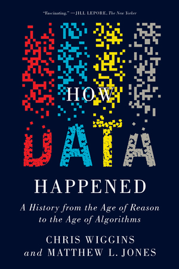

# Data Analysis

---
layout: image-right
image: image-12.png
backgroundSize: contain
---

## Data Science

- Math <small>(but mostly Statistics)</small>
- Programming
- Domain Knowledge


## Data Analysis

The confluence of Math and Domain Knowledge.

---

## Types of Analysis
We can categorize data analysis into three main types.

### Descriptive
Summarizing or explaining trends within data.

### Predictive
Making predictions based on existing data.

### Prescriptive
Recommending actions based on predictions.

---
layout: image-right
image: image-1.png
---

## Descriptive Analysis

Alice, a Data Scientist, pulls data on visits to her LA/NYC news-focused website inspecting:

- Times of user arrivals
- IP addresses (to identify user locations)
- Screen sizes

<div v-click>

After aggregating by `hour`, `location`, and `screen_size`, she notices spikes in traffic from <span v-mark="{at: 2, color: 'orange', type: 'underline'}">small-screen devices</span> at:
- New York at <span v-mark="{at: 2, color: 'orange', type: 'underline'}">1pm (EDT)</span>
- Los Angeles at <span v-mark="{at: 2, color: 'orange', type: 'underline'}">10am (EDT)</span>.

</div>

<div v-click>

She can **describe** these traffic patterns by the times, screen sizes, and city.

</div>

---
layout: image-right
image: image.png
---

## From Descriptive to Predictive

Now, Alice is planning a launch for the same site in Chicago. She uses her descriptive findings (peak times, device usage, traffic spikes) to **predict** how new Chicago readers might behave.

For example, she might guess:

<div v-click>

- Chicago traffic will also peak around **lunch hours** on small-screen (likely mobile) devices.
- There may be similarities in local time-based usage patterns (e.g., a spike around 12pm local time).

</div>

---

## Prescriptive Analysis

Alice’s boss, Bob, wants to **increase traffic** based on her predictions. What should they do?

<div v-click>

- **Timing**: Schedule targeted notifications or new content releases around local midday in each city to capture users during their break.
- **Mobile Optimization**: Ensure the site is well-optimized for small screens, because spikes are seen on mobile devices.

These recommendations (or **prescriptions**) are guided by the prior descriptive and predictive insights.

</div>

---

## What did Alice need?

<div v-click>

### Data Access

Alice needed web traffic logs (timestamps, locations, screen sizes).

### Aggregation & Trend Identification

Tools (like Pandas) to group the data by time/location and find peaks.

### Domain Knowledge

Interpreting results in context (e.g., understanding lunch breaks, mobile usage, local times).

### Testable Predictions

Ability to validate guesses (e.g., comparing Chicago’s actual launch metrics to predicted metrics).

</div>

---

## What Is the Role of a Data Analyst?

- **Data Gathering:** Like Alice, a data scientist locates, collects, and integrates data from various sources (e.g., server logs, APIs, databases).

- **Data Cleaning and Preparation:** Alice ensures the data is accurate and consistent by handling missing values, correcting errors, and transforming formats.

- **Analysis and Modeling:** Using statistical methods or machine learning, Alice explores the data to uncover patterns and build predictive or descriptive models.

- **Domain Knowledge:** Just like Alice uses her understanding of web traffic behavior, domain expertise helps interpret results meaningfully.

- **Communication and Storytelling:** A crucial part of Alice’s role is explaining insights—often through visualizations, reports, or presentations—to guide decision-making.

- **Prescriptive Action:** Finally, based on findings, Alice recommends actions or strategies (e.g., the best time to launch a campaign) to stakeholders like her boss, Bob.

---
layout: section
hideInToc: true
---

# Data

---
layout: center
---

<div class="book-3d">
  <div class="book-3d__inner">
    
  </div>
</div>

---
layout: image-right
image: 18th_century_crime_statistics.jpg
---

## Statistics:<br>A Matter of State

- In the 18th century, as empires expanded, governments collected data on population, land, and resources for administration.
- The word “statistics” initially meant **knowledge of the state** — counting births, deaths, taxes, etc.
- In the beginning, statistics was really just about collecting **datasets**.

---
layout: image-right
image: image-2.png
backgroundSize: contain
---

## What Is a Dataset?

- A **dataset** is a structured collection of data, often presented in tabular form with rows representing different observations (e.g., users, timestamps) and columns representing features or variables (e.g., IP address, screen size, city).

- The goal of **describing** a dataset is to understand its key characteristics—like typical values, spread, and the relationships among variables.


---
layout: two-cols-header

---

## Kinds of Data

::left::

#### Nominal
Labels or cateories<br>(city, gender)

#### Ordinal
Nominal but with order<br>(ratings, t-shirt sizes)

#### Continuous
Numeric values that **can** be divided into smaller fractional values<br>(e.g., height, weight)

#### Discrete
Numeric values that **can not** be divided<br>(e.g., number of children)

::right::

<br><br><br>


---
layout: statement
---

## What Kind of Data is Color?
Nominal?, Ordinal?, Continuous?, Discrete?

---
layout: image-right
image: image-4.png
backgroundSize: contain
---

## Color

- The statistician says it's "Nominal"
- The designer says it's "Ordinal"
- The computer scientist says it's "Discrete"
- The painter say it's "Continuous"

_Interpretation of a piece of data depends a lot on the context._

---
layout: section
hideInToc: true
---

# Central Tendency

---
layout: image-right
image: adolphe_quetelet.jpg
---

## Adolphe Quetelet
(1796–1874)

- Adolphe Quetelet was a Belgian astronomer deeply fascinated by the methods astronomers used to precisely measure stars.
- In 1834, he traveled to the Paris Observatory, where he encountered astronomers (notably Pierre-Simon Laplace) using statistical averaging to reconcile slight differences in repeated star observations.
- This inspired Quetelet to apply the same averaging techniques to human and social data, such as crime rates and physical measurements, laying the groundwork for ideas like the “Average Man” and BMI.

---
layout: center
---

The determination of the average man is not merely a matter of speculative curiosity; it may be of the most important service to the science of man and the social system. It ought necessarily to precede every other inquiry into social physics, since it is, as it were, the basis.

The average man, indeed, is in a nation what the centre of gravity is in a \[astral\] body; it is by having that central point in view that we arrive at the apprehension of all the phenomena of equilibrium and motion.

― Adolphe Quetelet, Treatise of Man and the Development of His Faculties

---
layout: image-right
image: mean_median.png
backgroundSize: contain
---

## Measures of Central Tendency

1. **Mean**
   The arithmetic average.
   $\bar{x} = \frac{1}{n}\sum_{i=1}^n x_i$

2. **Median**
   The middle value in an ordered set. Often more robust to outliers than the mean.

3. **Mode**
   The most frequently occurring value.

---
layout: image-right
image: mean_median.png
backgroundSize: contain
---

## Mean vs. Median

- Outliers or skewed data can heavily distort the mean. The median is more stable against extreme values.

- Notice how a few large values can **pull the mean** to the right, whereas the median stays near the center of most data points.

- Generally, **median** is preferred.


---
layout: image-right
image: image-6.png
backgroundSize: contain
---

## Forever Age Distribution

```python
ages = df["If you could be any age forever, what would it be?"]

plt = ages.hist(bins=(ages.max() - ages.min()))

plt.axvline(ages.mean(), color="red")
plt.axvline(ages.median(), color="green")
```

---
layout: image
image: image-5.png
backgroundSize: contain
---

---
layout: image-right
image: standard_deviation_diagram.svg.png
backgroundSize: contain
transition: fade
---

## Standard Deviation

A measure of how spread out the data is around the mean.

$\text{stddev} = \sqrt{ \frac{1}{N-1} \sum_{i=1}^{N} (x_i - \overline{x})^2 }$

- **Low** std dev: Data points are close to the mean.
- **High** std dev: Data points are spread out over a wider range.

---
layout: image-right
image: standard_deviation_diagram.svg.png
backgroundSize: contain
---

## The Normal Distribution

Also known as the **Bell Curve** or **Gaussian Distribution**:

- Symmetrical about the mean.
- Mean = Median = Mode.
- A large proportion (68%–95%–99.7%) of the data lies within 1–3 standard deviations from the mean.


---
layout: image
image: image-8.png
backgroundSize: contain
---


---
layout: image-right
image: min_max_5th_95th.png
backgroundSize: contain
---

## Range and Percentiles

- **Minimum / Maximum**: The smallest and largest values in the dataset.
- **Range**: max - min.
- **5th & 95th Percentiles**: Often used to ignore extreme outliers and capture where most data lies.
- **Quantiles**: Another name for percentile (just multiply by 100 to switch between them).
- **Interquartile Range (IQR)**: The range between the 25th and 75th percentiles.

---
layout: image-right
image: eugenics_birth.jpg
---

## Francis Galton (1822–1911)

### The Good
- Expands on Quetelet's ideas.
- Introduced **regression** and **correlation**.

### The Ugly
- Influenced by his cousin, Charles Darwin.
- Aimed to rank individuals within distributions (blame him for the SATs).
- Believed intelligence and ability is inherited.
- Coined the term **“eugenics”** to describe the conscious effort to improve the quality of human beings.

---
layout: center
---

"We want abler commanders, statesmen, thinkers, inventors, and artists.

The natural qualifications of our race are no greater than they used to be in semi-barbarous times, but the conditions amid which we are born are vastly more complex than of old."

~ Francis Galton

---
layout: image-right
image: image-11.png
backgroundSize: contain
---

## What Makes an Outlier?

- Is it significantly outside the inner fences?
  - Using percentiles
    - $x < p5$ or $x > p95$
  - Using IQR
    - $IQR = p75 - p25$
    - $x < Q_1 - 1.5 * IQR$
    - $x > Q_3 + 1.5 * IQR$
  - Using z-scores (if data is normal)
    - $z = \frac{x - \bar{x}}{stddev}$
    - $z > 3$ or $z < -3$
- Always interpret with domain knowledge:
   - Is this a natural part of the data set?
   - Is this an error?


---
layout: image-right
image: image-7.png
backgroundSize: contain
---

# TODO

## Forever Age Distribution w/out Outliers

```python
ages = df["If you could be any age forever, what would it be?"]

p95 = ages.quantile(.95)
p05 = ages.quantile(.05)

ages = ages[(ages < p95) & (ages > p05)]

plt = ages.hist(bins=(ages.max() - ages.min()))

plt.axvline(ages.mean(), color="red")
plt.axvline(ages.median(), color="green")
```

<!-- Mine is 28, world average is 36 -->


---
layout: image-right
image: image-3.png
backgroundSize: contain
---

## Linear Regression

A statistical method for modeling relationships between a **dependent variable** and one or more **independent variables**. The simplest form is:

$$
y = mx + b
$$

Where \( m \) is the slope and \( b \) is the intercept.

_Galton originally studied how children’s heights regressed toward the mean height of the population._

---
layout: image-right
image: image-9.png
backgroundSize: contain
---

## IVs vs. DVs

- **Independent Variable (IV):** The factor you believe influences or causes changes.
- **Dependent Variable (DV)**: The outcome that responds to changes in the IV(s).
- **Regression** is a way to model and measure the relationship between the IV(s) and DV.

### Example: Car Travel
- **IV:** Time driving (minutes, hours)
- **DV:** Distance from start point
- **Regression:** Estimated speed (slope) – how fast distance changes over time.

---
layout: image-right
image: correlation.webp
backgroundSize: contain
---

## Correlation

Indicates the strength and direction of a relationship between two variables.
A classic formula for **Pearson’s correlation** ($r$):

$$
r = \frac{\sum (x_i - \overline{x})(y_i - \overline{y})}{\sqrt{\sum (x_i - \overline{x})^2 \sum (y_i - \overline{y})^2}}
$$

- **+1**: Perfect positive correlation.
- **0**: No linear correlation.
- **-1**: Perfect negative correlation.

### Covariance

How two variables change together:

$$
cov(X,Y) = \frac{\sum_{i=1}^n (x_i - \bar{x})(y_i - \bar{y})}{n-1}
$$

---
layout: image-right
image: image-10.png
backgroundSize: contain
---

## Correlation<br>DOES NOT IMPLY<br>Causation

- **Correlation**: Two variables move together.
- **Causation**: One variable causes the other to move.

It’s easy to find **spurious correlations** that are not meaningful.

---
layout: iframe
url: https://www.tylervigen.com/spurious-correlations
---

---
layout: section
hideInToc: true
---

# Making Sense of a Dataset

---
layout: two-cols-header
---

## Analyzing a New Dataset

::left::

### 1. **What Kind of Data?**
   - Nominal, ordinal, continuous, discrete?

### 2. **Central Tendency**
   - Mean, median, mode.

### 3. **Spread**
   - Range, standard deviation, IQR, percentiles.

::right::

### 4. **Inspect Shape**
   - Is it normal? Is there skew or kurtosis?

### 5. **Identify Outliers**
   - 5th/95th, IQR, z-score.

### 6. **Look for Relationships**
   - Correlation, covariance.

<br><br>