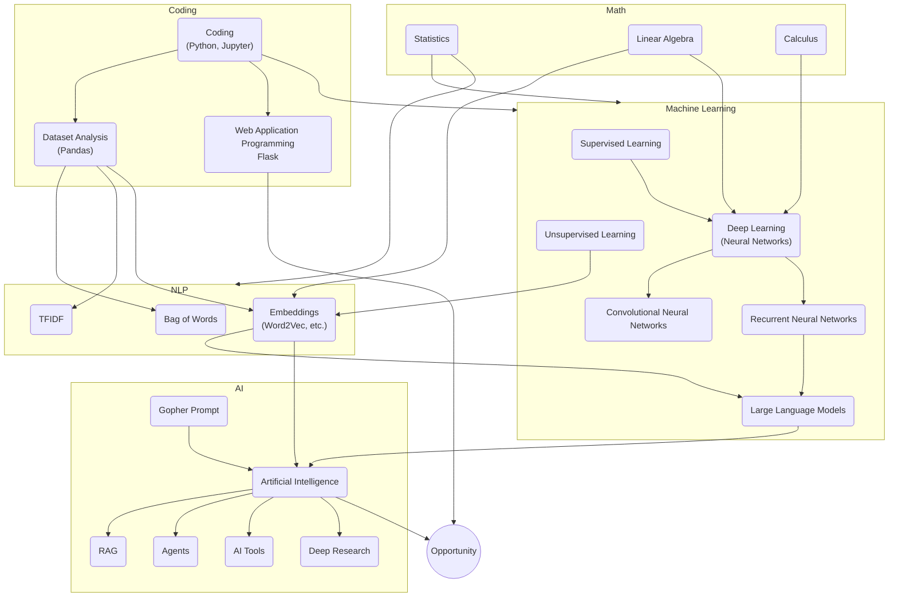
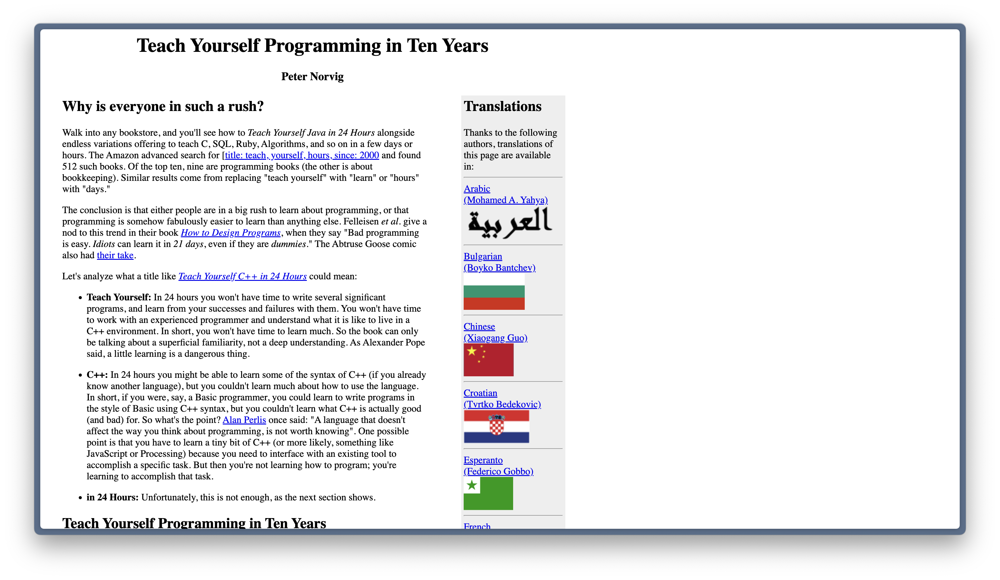

# Wrap Up

---
layout: cover
hideInToc: true
---

# `print("hello world")` to Intelligent Chatbots

---
layout: image-right
image: decks/02_python_basics/a-byte-of-python.png
backgroundSize: contain
---

## 1. Python Basics

- **Syntax, Variables, and Conditionals**  
  We wrote our first `print('hello world')` and explored types, conditinals, and flow control.
- **Functions**  
  Python’s `def` for reusable pieces of code, including argument types, default arguments, and docstrings.
- **Data Structures**
  Lists and dictionaries and the basics of objects.

**Why it mattered:** Python is the backbone for data science and duct-tape of machine learning.

---
layout: image-right
image: decks/04_jupyter_notebooks/image-6.png
backgroundSize: contain
---

## 2. Jupyter Notebooks

- **Interactive Environment**  
  We discovered Jupyter/Colab, perfect for data exploration and live coding.

- **Cells and Markdown**  
  A flexible format mixing code, visuals, and text.

- **Practical Workflows**  
  Iterative approach to analysis, visualizations, and quick debugging.

**Why it mattered:** This gave us a powerful workspace to combine code, plots, and explanations in one place, bridging data science and storytelling.

---
layout: image-right
image: decks/05_data_analysis/image-1.png
backgroundSize: contain
---

## 3. Data Analysis & Pandas

- **Descriptive Statistics**  
  Mean, median, mode, standard deviation, outliers.
- **Series and DataFrames**  
  Introduced to the wonders of `pd.DataFrame`, aggregation, grouping, and filtering.
- **Exploring Datasets**
  We went over loading and handling of CSV files.

**Why it mattered:** Being able to wrangle and summarize data is essential before any modeling or machine learning.

Knowing how to do this lets you bring this class to your problems.

---
layout: image-right
image: decks/05_data_analysis/image-10.png
backgroundSize: contain
---

## 4. Statistics & Probability

- **Distributions & Outliers**  
  Understanding normal distribution, IQR, z-scores.
- **Correlation ≠ Causation**  
  Interpreting scatter plots and correlation coefficients carefully.
- **Basic Probability & Expected Value**  
  Probability rules, Markov chains, random variables, and expected outcomes.

**Why it mattered:** This gave us the math to interpret data patterns and to model uncertainty.

This is a core skill for any data scientist or machine learning engineer.

---
layout: image-right
image: decks/07_nlp/image-2.png
backgroundSize: contain
---

## 5. Natural Language Processing

- **Text Preprocessing**  
  Tokenization, lowercasing, stopword removal, stemming/lemmatization.
- **Bag of Words / TF-IDF**  
  Converting raw text into numerical features.
- **Word Embeddings**  
  Representing words in dense vectors (Word2Vec, GloVe, etc.).
- **Sentiment Analysis**  
  Simple lexicon-based approach and using `TextBlob`.

**Why it mattered:** Language data is messy; these tools let us handle real-world text, transform it into features, and start performing text analytics.

---
layout: image-right
image: decks/09_machine_learning_supervised/image-3-2.png
backgroundSize: contain
---

## 6. Machine Learning

- **Supervised**  
  - Regression (Linear, Logistic)  
  - Classification (Decision Trees, Accuracy vs. Precision/Recall)
- **Unsupervised**  
  - Clustering (K-Means)  
  - Dimensionality Reduction (PCA)  
  - Anomaly Detection

**Why it mattered:** This is how we predict and discover patterns. From predicting continuous values to uncovering hidden groupings in unlabeled data.

---
layout: image-right
image: decks/12_neural_networks/image-1.png
backgroundSize: contain
---

## 7. Deep Learning

- **Neural Networks**  
  Multi-layer perceptrons, forward/backprop, activation functions (ReLU).
- **CNNs**  
  Convolution, pooling, and how we handle images effectively.
- **RNNs**  
  LSTM and how we tackle sequential data (time series, text).

**Why it mattered:** Deep nets supercharge machine learning, letting us learn complex patterns in images, sequences, and more.

---
layout: image-right
image: decks/15_llms/image-6.png
backgroundSize: contain
---

## 8. LLMs & AI

- **Transformers**  
  Self-attention, multi-head attention, positional embeddings.
- **Prompt Engineering**  
  Instructing language models (LLMs) by constructing a “role” for the AI.
- **RAG & Tools**  
  Combining retrieval with generation, calling external APIs, building agentic workflows.

**Why it mattered:** This is the front line of AI innovation—foundation models that can handle text, code, and tasks at scale.

---
layout: section
---

---
layout: section
hideInToc: true
---

# Career Pathways

---
layout: image-right
image: decks/17_final_class/image-1.png
---

### Software Engineer

**Role**: Develops, tests, and maintains software.

**Focus**: Often specialized (frontend/backend, product/infrastructure).

**Stakeholders**: Internal teams or external customers.

**Overlap**: Works closely with all other tech roles.

**Salary**: \$128K–\$253K  
<small>(Levels.fyi, 25th–75th percentile)</small>

**Education**:
- Typical: Bachelor’s in Computer Science
- Many are also self-taught

---
layout: image-right
image: decks/17_final_class/image-2.png
---

### Data Engineer

**Role**: Designs and maintains data pipelines and models.

**Focus**: Data lifecycle and governance.

**Stakeholders**: Mostly technical (Data Scientists, Analysts).

**Overlap**: Strong ties to Software Engineering and MLE.

**Salary**: \$128K–\$253K  
<small>(Levels.fyi, 25th–75th percentile)</small>

**Education**:
- Typical: CS or Data Science degree
- Industry certifications are common

---
layout: image-right
image: decks/17_final_class/image-3.png
---

### Machine Learning Engineer

**Role**: Builds and deploys ML models in production.

**Focus**: Performance monitoring and model serving.

**Stakeholders**: Technical leads or business units with KPIs.

**Overlap**: Primarily with Data Engineering and Data Science.

**Salary**: \$128K–\$253K  
<small>(Levels.fyi, 25th–75th percentile)</small>

**Education**:
- Typical: CS or Data Science background
- Certifications or specialized courses

---
layout: image-right
image: decks/17_final_class/image-4.png
---

### Data Scientist

**Role**: Analyzes data to extract insights and drive decisions.

**Focus**: Exploratory analysis, predictive modeling, and visualizations.

**Stakeholders**: Can be technical teams or business executives.

**Overlap**: MLE, Data Engineering, and Business Analysts.

**Salary**: \$125K–\$222K  
<small>(Levels.fyi, 25th–75th percentile)</small>

**Education**:
- Common: Bachelor’s/Master’s in CS, Statistics
- Many have PhDs (“academic converts”)

---
layout: image-right
image: decks/17_final_class/image-5.png
---

### Business Analyst

**Role**: Uses data to guide business decisions.

**Focus**: Reporting, dashboards, and stakeholder communication.

**Stakeholders**: Typically non-technical teams.

**Overlap**: Collaborates with Data Science and Data Engineering.

**Salary**: \$87K–\$145K  
<small>(Levels.fyi, 25th–75th percentile)</small>

**Education**:
- Often: Business, Economics, or Data Science degree

---
layout: image-right
image: decks/17_final_class/image-6.png
---

### Research Scientist

**Role**: Conducts specialized research and experiments.

**Focus**: Developing new theories, publishing in journals/conferences.

**Stakeholders**: Primarily funded by grants or universities.

**Overlap**: Data Scientists, ML Engineers (in R&D settings).

**Salary**: Varies widely (often grant-based or academic scale)

**Education**:
- Typically a PhD in a relevant field
- Postdoc experience is common

---

## Kinds of Workplaces

| Type | Salary | Vibe | Job Security | Scope of Work |
|------|--------|------|--------------|---------------|
| Big Tech | High | Competitive | Good | Limited |
| Startups | Low | Exciting | Poor | Broad |
| Academia | Low | Intellectual | Good | Deep |
| Banks | High | Conservative | Good | Limited |
| Government | Low | Bureaucratic | Good | Broad |

---
layout: two-cols-header-2
---

## Fields That Use Data Science

::left::

Manufacturing

Finance

Molecular Biology

Healthcare

Supply Chain

Journalism

::right::

Education

Legal Services

Sales

Environmental Science

Marine Biology 

Public Policy

---
layout: center
---

> I’m a mediocre cartoonist, a mediocre writer, and a mediocre businessperson. But I’m a combination of all three, and the intersection of mediocrity makes me successful.

---
layout: two-cols-header-2
---

## What to Study

::left::

### Math

- Calculus 1, 2
- **Linear Algebra**
- **Graph Theory**
- Abstract Algebra

### Statistics
- **Probability Theory**
- **Statistical Inference**
- Regression Analysis
- Elementary Stockastic Processes
- Time Series Analysis

::right::

### Computer Science

- **Data Structures**
- **Algorithms**
- **Databases**
- Computer Architecture
- Operating Systems
- Networking

### Soft Sciences

- Basic Psychology
- Philosophy of Language
- Logic

---
layout: section
hideInToc: true
---

# My Own Path to Data Science

---
layout: image-right
image: decks/17_final_class/7E060A12-AF37-4670-B7A2-4030D0F565D6_1_105_c.jpeg
backgroundSize: contain
---

## My Education

- I had no access to Computer Science education at my high school.
- I started game development classes at my Community College during my senior year.
- I applied to college during the 2008 financial crisis and ended up at a Community College where I got my Associate’s Degree in Mathematics.
- I transferred to **Rutgers University** and double-majored in **Computer Science** and **Mathmatics** (my "for fun" major).
- At Rutgers, I was President of the Computer Science Club and a Math Department TA.

---
layout: image-right
image: decks/17_final_class/image-8.png
---

## My Education (cont.)

- I spent all my free time in college at **Hackathons** exploring new technologies.
- As President of the Computer Science Club, I organized coding classes and workshops for non-traditional subjects like web development.
- I joined a fellowship program called **HackNY** that brought me to NYC and placed me at a startup called **Branch** and I fell in love with startups.

---
layout: image-right
image: decks/17_final_class/image-7.png
---

## Work Experience

- After my fellowship I contracted for startups until graduation.
- After graduation, I worked as an Engineer at a startup, **Chartbeat**, where I discovered Data Science and a use for my Math degree.
- In 2017 I joined a startup, **Oden Technologies**, as a Data Scientist.
- In 2019 I published my first machine learning paper at **ICDM** in Beijing.
- During my career I've presented at conferences around the world.

**I started teaching in 2024 to create the education I didn't have in High School.**

---
layout: image-right
image: decks/17_final_class/544C8A2B-915A-4472-A23D-357354656DAB_1_105_c.jpeg
---

## My Coding Journey

- My first programming language was **Bash**.
- In HS I learned **C++** for game development.
- In college I learned **JavaScript**, **Java**, and **C**.
- At Branch: **Ruby** and **Coffeescript** 🪦
- At Chartbeat: **Python**, **C**, and ✨**Clojure**✨.
- At Oden: **Python**, **Go** 🤮, and **Java**.

### Specialization

**Stream Processing**: Handling data in real-time. Lots of real-time prediction and modeling.

**Machine Learning**: I don't love modeling, but I love the math, the data, and the engineering.

**Rapid Prototyping**: I build garbage quickly.

---
layout: center
---

{width=90%}

https://norvig.com/21-days.html

---
layout: section
hideInToc: true
---

# How to Be Successful

My three-step fool-proof plan to be successful in Data Science, Machine Learning, or anything.

---
layout: image-right
image: decks/17_final_class/Screen Recording 2025-03-22 at 9.56.51 PM.gif
backgroundSize: contain
---

## Step 1: Be Interested

- You can do Data Science and Machine Learning without fixating on only that!
- Programming and Math are both enormous fields littered with interesting detours.
- Detours should not only be expected but embraced.

### Examples

- My years as a Ruby on Rails developer taught me how the internet works.

- My hobbies as a game developer reinforced my math skills and taught me how to think about state.

---
layout: image-right
image: decks/17_final_class/12seasons-nyc-2025-03-22.png
backgroundSize: contain
---

## Step 2: Make Stuff

- If you want to be a good coder, you need to write a lot of code.
- The same is true for Data Science and Machine Learning.
- Nothing will teach you more than doing the thing you want to be good at.
- Nothing will be more satisfying than having a stupid project idea and being about to run out an build it.

Learn some basic **Web Frameworks** (Flask, FastAPI, HTMX), **Game Frameworks**, (PyGame, Pico-8, PhaserJS), **Art Generation** frameworks (Processing, P5.js, three.js, d3.js), and **anything that interests you**.

---
layout: image-right
image: decks/17_final_class/IMG_0025.JPG
---

## Step 3: Find Community

Building things is a life-long journey that's more fun with friends.

Surround yourself with people who are smart, hard-working, and share your passion.

### Examples
- Join your school Computer Science club.
- Take part in a hackathon.
- Attend a meetup.
- Join a Discord server.
- **Connect with your fellow students in this class.**

---
layout: cover
hideInToc: true
---

# Thank You

- I will be writing **Evaluation Letters** for all of you. TThese will include details about the course and the assignments you completed and will be delivered by Columbia.

- I will email you all of the slides at the end of this class and the source code will be available at at [github.com/x/bigd-204](https://github.com/x/bigd-204).

### Contact

My Columbia email will be shut down (for a few months) next week. You can reach me at:

**Email**: [devon@peticol.as](mailto:devon@peticol.as)

**Github**: [github.com/x](http://github.com/x)