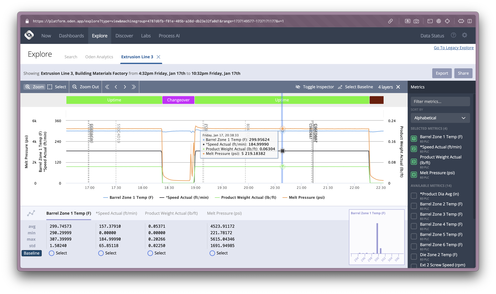

# Introduction

---
layout: quote
transition: fade
---

## What is this Class?

> Data science and machine learning are exciting and popular disciplines. While different fields, they work best in sync to help change the way humans think, behave, and interact. In fact, some of the most popular data science methods stem from machine learning. Through this course, students will be introduced to the foundations of both science areas and explore available career opportunities. Beginning with an overview of the landscape and real-world applications, students will learn how data science and machine learning impact the world in which we live, every day. Further, students will gain hands-on experience with introductory coding using Python and become versed in popular machine learning algorithms. By the end of the course, students will use their benchmark knowledge to analyze and present data ethically and effectively. Finally, students will leave the course prepared for more advanced practice in data science and machine learning. 

~ BIGD103 Description by Columbia University

---
layout: quote
---

## What is this Class?

1. We're going to talk a lot about Data Science and Machine Learning.
2. We're going to build our Python skills.
3. We're going to build our statistics fundamentals.
4. We're going to learn Data Science techniques.
5. We're going to learn Machine Learning.
6. We're going to learn about AI.

---

## What's the Difference from `BIGD204`?

**`BIGD204` is not _really_ a continuation of `BIGD103`.**

- `BIGD204` is a more advanced class for students who already have a strong foundation in Python and/or Data Science and Machine Learning.
- Each professor teaches this class differently.

**We will spend the first third of this class building our programming Python skills.**

- I will try to scaffold the assignments but, if you already have a strong foundation, you may find the first week slow!
- Things will pick up quickly after that.

**If, in the first week, you feel `BIGD204` would be a better fit for you, you can switch!**


---

## About Me

- **Mr. Peticolas** (Mr. P)
- **Email:** `dp3305@columbia.edu`
- I've worked at startups on Data Science teams for 13 years.
- Today I work at [Oden Technologies](https://oden.io/) where we employ DS & ML for manufacturing.
- This is my **third** time teaching this class at Columbia.

### My Hobbies
- Programming applications and games.
- Long-distance cycling.
- Baking and ice cream making.

---
layout: center
---



---

## Learning Objectives

1. **Apply** data science skills using real-world data to **create** meaningful, interactive applications addressing authentic problems.

2. **Analyze** and **implement** practical machine learning approaches to **solve** real-world problems, emphasizing pragmatic solutions over deep theory.

3. **Examine** and **employ** large language models (LLMs) to **enhance** data-driven applications.

---
layout: section
hideInToc: true
---

# Subjects

---
layout: image-right
image: image-1.png
---

## Python

- **What is Python?**
  - A versatile, high-level programming language
- **Key Features**
  - Simple syntax, readability, extensive libraries
- **Why Python for Data Science and AI?**
  - Strong community support and popularity as a "Duct Tape" language
- **Use Cases**
  - Web development, automation, data analysis, machine learning

---
layout: image-right
image: 18th_century_crime_statistics.jpg
---

## Data Science

- **What is Data Science**
  - Science of extracting insights from data
  - Joins applied math, software engineering, and domain context
- **Key Components**
  - Data collection, cleaning, analysis, visualization
- **Tools and Technologies**
  - Python, R, SQL, Jupyter Notebooks
- **Applications**
  - Business intelligence, healthcare, finance, marketing, academia, everywhere...

---
layout: image-right
image: image-2.png
---

## Machine Learning

- **What is Machine Learning?**
  - A subset of AI focused on building systems that learn from data
- **Types of Learning**
  - Supervised, Unsupervised, Reinforcement
- **Common Algorithms**
  - Linear Regression, Decision Trees, Neural Networks
- **Real-World Examples**
  - Recommendation systems, image recognition, natural language processing


---
layout: image-right
image: image-3.png
transition: fade
---

## Artificial Intelligence (AI)

- **Definition**
  - The simulation of human intelligence in machines
- **Large Language Models (LLMs)**
  - A subset of deep learning that understands and generates text
- **Applications of LLM-base AI**
  - Chatbots, content generation, language translation, data enrichment

---
layout: image-right
image: image-4.png
---

## Artificial Intelligence (AI)

- **Definition**
  - The simulation of human intelligence in machines
- **Large Language Models (LLMs)**
  - A subset of deep learning that understands and generates text
- **Applications of LLM-base AI**
  - Chatbots, content generation, language translation, data enrichment


---
layout: center
---

"Tell me and I forget. Teach me and I may remember. <span v-mark="{ at: 1, color: 'orange', type: 'underline' }">Involve me and I learn</span>."

~ Benjamin Franklin

---

## Projects

#### **Project 1 - Python Web App**
- **Format:** Python Web App (Flask)
- **Task:** Build an interactive web app that allows a player to play a ‘Choose Your Own Adventure’
- **Deliverable:** A working Flask application that navigates the user through a series of prompts and questions.

#### **Project 2 - Bluesky Sentiment Analysis**
- **Format:** Jupyter Notebook
- **Task:** Perform sentiment analysis on a subset of the Bluesky dataset.
- **Deliverable:** A notebook with EDA, text preprocessing, a basic sentiment model, and a short written or slide-based report of findings.

#### **Project 3 – Open Ended Final Project**
- **Format:** Open Ended 
- **Task:** Build a creative application that utilizes an LLM to generate, annotate, or guide the experience.
- **Deliverable:** A working application or analysis that demonstrates the use of an LLM in a creative way.

---
layout: two-cols-header-2
---

## Week 1: Python Fundamentals

::left::

**Tuesday, July 22nd: Getting Started with Python**
- Morning: Course Introduction & Python Basics
- Afternoon: Conditionals and Control Flow

**Wednesday July 23rd: Loops and Functions**
- Morning: Loops and Iteration
- Afternoon: Functions

::right::

**Thursday, July 24th: Data Structures**
- Morning: Lists and Strings
- Afternoon: Dictionaries and Complex Data

**Friday, July 25th: Project Day**

(_I will be absent, we have a substitute teacher._)
- Morning: Video Lecture
- Afternoon: Project Afternoon


---
layout: two-cols-header-2
---

## Week 2: Data Science

::left::

**Monday, July 27th: Introduction to Data Science**
- Morning: What is Data Science?
- Afternoon: Introduction to Pandas and CSV Data

**Tuesday, July 28th: Aggregation Statistics**
- Morning: Data and Statistics Fundamentals
- Afternoon: The Unreasonable Power of Group By

**Wednesday, July 29th: Data Visualization**
- Morning: More Statistics
- Afternoon: Introduction to Data Visualization

::right::

**Thursday, July 30th: Natural Language Processing**
- Morning: Introduction to NLP
- Afternoon: NLP in the Real World

**Friday, August 1st: Real-World Data Science and Project Day**
- Morning: Time Series Analysis
- Afternoon: Project


---
layout: two-cols-header-2
---

## Week 3: Machine Learning and AI

::left::

**Monday, August 4th: Introduction to Machine Learning**
- Morning: What is Machine Learning?
- Afternoon: Supervised Learning - Regression

**Tuesday, August 5th: Classification and Model Evaluation**
- Morning: Supervised Learning - Classification
- Afternoon: Feature Engineering

**Wednesday, August 6th: Unsupervised Learning and Neural Networks**
- Morning: Unsupervised Learning
- Afternoon: Introduction to Neural Networks

::right::

**Thursday, August 7th: Neural Networks and Deep Learning**
- Morning: Specialized Neural Networks
- Afternoon: Large Language Models

**Friday, August 8th: Large Language Models and AI Applications**
- Morning: Modern AI Applications
- Afternoon: Presentations and Closing


---

## Reading Materials

_All reading material for this class is freely available online._

-	<span v-mark="{ at: 1, color: 'orange', type: 'underline' }">‘A Byte of Python’</span>

    https://python.swaroopch.com/

-	‘Think Stats, 2nd Edition’
 
    https://greenteapress.com/thinkstats2/html/index.html

-	‘An Introduction to Statistical Learning, with Applications in Python’

    https://hastie.su.domains/ISLP/ISLP_website.pdf.download.html

_For the most part, things will be in the slides and assignments that I distribute._


---
layout: header-link
---

### `courseworks2.columbia.edu/courses/220757`

Everyone should have access to the Courseworks page for this class!

I will be posting all the slides, assignments, and other materials there.

---

## Example Class Structure

- 1:00 to 1:10pm (10m) - Do Now
- 1:10 to 1:40 (30m) - Lecture
- 1:40 to 1:45 (5m) - Break
- 1:45 to 2:15 (30m) - Lecture or Activity
- 2:15 to 2:20 (5m) - Break
- 2:20 to 2:50 (30m) - Lecture or Activity
- 2:50 to 3:00 (10m) - Wrap Up

---
layout: header-link
---

## Let's Collect Some Data

TODO

---
layout: header-link
---

## Ice Breaker

Pick on question from the form and explain your answer.

---
layout: header-link
---

## Let's explore the data

### LIVE DEMO

---
layout: section
---

# Tech Check

---
layout: image-right
image: image-11.png
---

## Tools for the Job

### <u>Must</u> Haves

- **A Computer:** Windows, macOS, or Linux

- **Jupyter Notebooks:** Hosted by Columbia

- **Visual Studio Code:** Primary code editor.

### <u>Maybe</u> Haves

- **Python (3.x):** Our primary programming language.

- **Git:** For accessing and sharing code.

- **GitHub Account:** For storing and sharing projects.

---
layout: image-right
image: image-11.png
---

## Python on Windows

- The industry choice for traditional businesses.
- Requires downloading Python from python.org.
- May need to manually add Python to the PATH environment variable.
- Integrated development environments (IDEs) like PyCharm, VS Code, or IDLE work seamlessly.
- Supports package installation via pip in Command Prompt or PowerShell.
- Virtual environments can be a pain.

---
layout: image-right
image: image-14.png
---

## Python on Mac

- The industry choice for startups and small tech business.
- Pre-installed Python versions - usually outdated.
- Install the latest version using Homebrew (`brew install python`).
- Terminal is very similar to Linux.
- IDEs and editors like PyCharm, VS Code, Vim, and Emacs are widely supported.
- Virtual environment tools (`venv`) work well with minimal setup.

---
layout: image-right
image: image-15.png
---

## Python on Linux

- Popular in academia, open source industry, and the most popular server choice.
- Most distributions include Python pre-installed (often Python 3).
- Install or update via package manager (`apt`, `yum`, or `dnf`).
- Command-line tools are deeply integrated.
- IDEs and editors like PyCharm, VS Code, Vim, and Emacs are widely supported.
- Virtual environment management is straightforward using `venv`.


---
layout: image-right
image: image-5.png
---

## Python on Jupyter Notebooks

- Jupyter Notebooks are a web-based interactive computing environment.
- The were created for academic research and data science.
- They allow you to write and execute code in a web browser.
- **We will be using Jupyter Notebooks for assignments and projects.**

---
layout: image-right
image: ./c1111f14-f0f7-4128-8ccb-bc17bd6e2d81.png
---

## Using ChatGPT and other AI in this class

1. I'm going to treat you like adults.
2. You will not learn if AI writes your code.
3. I will know if AI wrote your code.

Everyone in this class should feel comfortable using AI tools to help them learn.

- Clarify concepts.
- Debug issues.
- Give examples.

**But you should be writing your own code.**

---
layout: center
---

## Breakout Exercise

TODO

- ~~We're going to break into groups of 3~~
- ~~One (or more) of~~ you will set up:
    - Python (https://python.swaroopch.com/installation.html)
    - VSCode (https://code.visualstudio.com/)
- You will write and run `Hello World` (https://python.swaroopch.com/first_steps.html)

  ```py
  print("Hello World")
  ```
