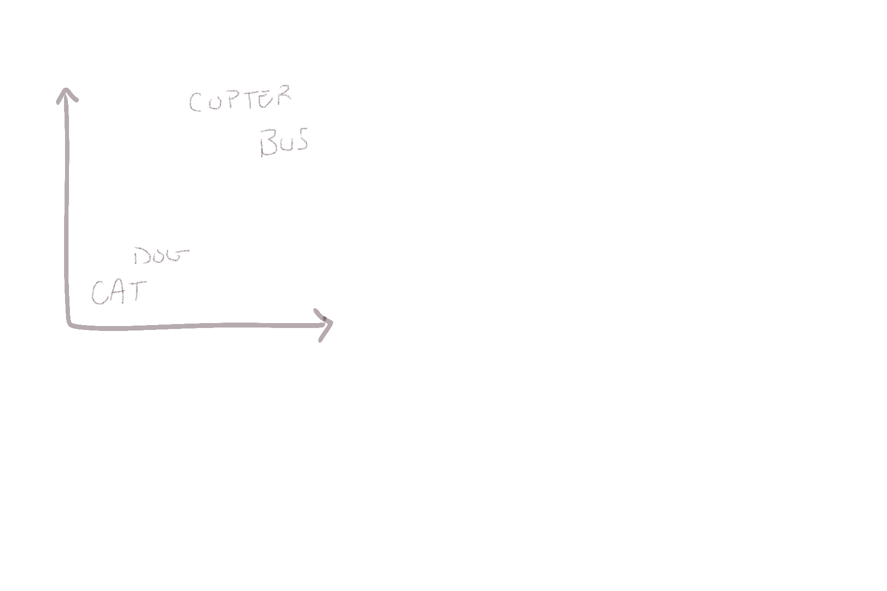
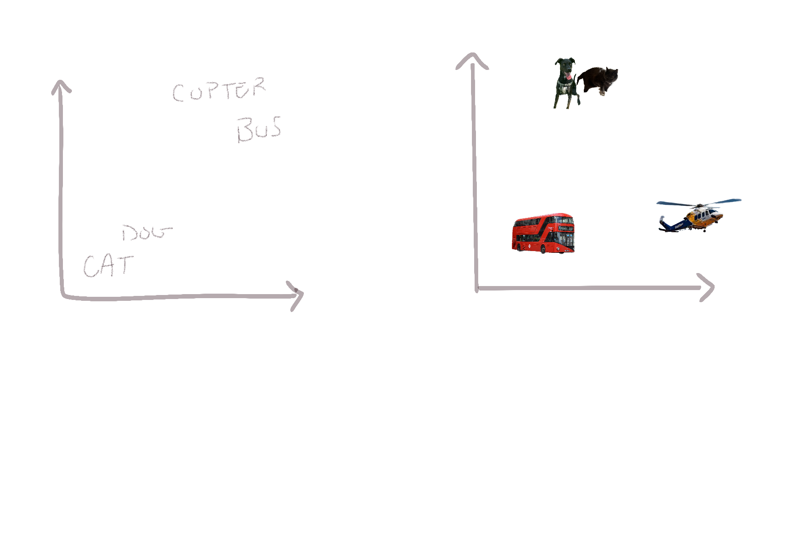
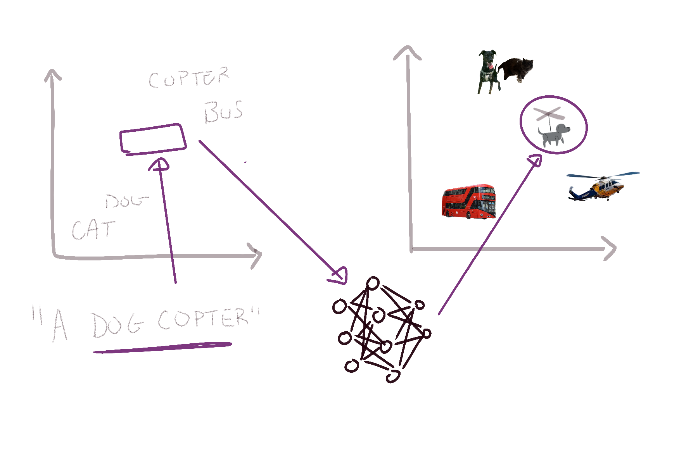
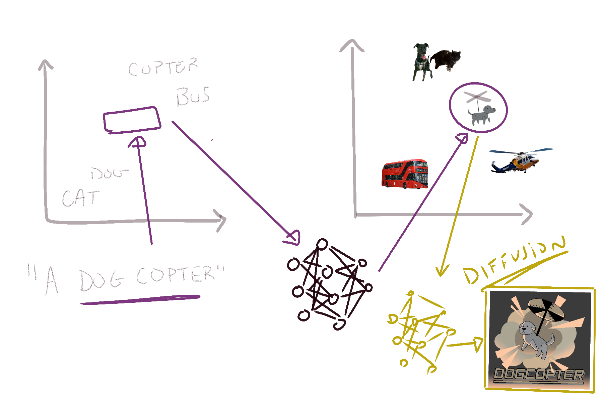

# Modern AI Strategies

---
layout: image-right
image: decks/16_modern_ai/image-7.png
backgroundSize: contain
---

## How the AI Works
<p class="subheading">Refresher</p>

**Architecture:** A neural network that predicts the next word in a sequence.

**Tokens:** Tokens (words) are converted into embedding vectors that represent meaning.

**Context:** The Transformer updates token embeddings using the context from the $n$ preceding tokens of the context window.

**Chat Interface:** A chat conversation prompt is fed into the context window, the model generates more conversation, and you are inserted as the latest "user" input.

---
layout: two-cols
---

## Prompt Engineering

Crafting or refining prompts so the large language model (LLM) produces the desired outputs without altering its internal parameters.

**Techniques**
- System prompts, role prompts, zero/few-shot examples
- Chain-of-thought or step-by-step instructions
- Use a larger model to generate condensed prompts for a smaller with fewer weights or a smaller context window.
- Some APIs allow for saving and reusing prompts (OpenAI's _CustomGPTs_ or _prompt caching_).

::right::

```python
import openai

def question_to_sql(question: str) -> str:
    messages = [
        # High-level guidance
        {"role": "system",
         "content": "You transform user questions into valid SQL queries."},
        # Example Q & A
        {"role": "user",
         "content": "Q: \"What are the top 10 oldest users from the 'users' table?\"\nA:"},
        {"role": "assistant",
         "content": "SELECT * FROM users ORDER BY age DESC LIMIT 10;"},
        # Now the real question
        {"role": "user",
         "content": f"Q: \"{question}\"\nA:"}]
    response = openai.ChatCompletion.create(
        model="gpt-3.5-turbo",
        messages=messages,
        max_tokens=60,
        temperature=0
    )
    return response.choices[0].message["content"].strip()

sql_query = question_to_sql("How many products are out of stock in 'inventory'?")
print(sql_query)
```

---
layout: two-cols-header-2
---

## Prompt Engineering vs. Model Tuning

::left::

### Prompt Engineering
Crafting prompts to feed the context the model needs to generate the desired output.

- **Technique**  
  - Role prompts, zero/few-shot examples
  - Chain-of-thought or step-by-step instructions
- **Advantages**  
  - **Fast iteration**: You simply adjust text prompts
  - **No re-training** needed
- **Limitations**  
  - Still constrained by the base model’s knowledge/capacity
  - Complex tasks may require elaborate prompts

::right::

### Model Tuning
Adjusting the model’s weights or parameters (e.g., fine-tuning with new data).

- **Technique**  
  - Gradient descent updates on additional labeled data
  - Methods like LoRA or full fine-tuning
- **Advantages**  
  - **Deep integration** of domain knowledge
  - Potentially **better perf.** on specialized tasks
- **Limitations**  
  - **More expensive** (GPU time, training loops)
  - Overfitting risks if data is limited

---
layout: two-cols-header-2
---

## Small LLMs vs. Large LLMs

::left::

### Small LLMs (Local)
Llama 3.3, Mistral (7B)
- **Pros**  
  - Can run **locally** without huge GPU clusters  
  - **Lower latency** for some tasks  
  - More **privacy** (no external API calls)  
- **Cons**  
  - Limited context window  
  - Often **less fluent** or accurate
- **Use Cases**  
  - Quick local text generation  
  - Games or creative projects
  - Offline/edge scenarios

::right::

### Large LLMs (Cloud)
GPT-4, Claude, Gemini
- **Pros**  
  - **High accuracy** & more “intelligence”  
  - Bigger context window & built-in tooling  
  - Vast **knowledge** and improved reasoning
- **Cons**  
  - **Costs** can grow quickly (API usage)  
  - Dependent on cloud access  
- **Use Cases**  
  - Complex reasoning & advanced Q/A  
  - Summarization of lengthy documents  
  - Enterprise applications with large data

---
layout: image-right
image: decks/15_llms/image-12.png
backgroundSize: contain
---

## Retrieval-Augmented Generation

**Problem**: LLMs can’t memorize or keep up with all data (e.g., an entire encyclopedia).

**Solution**
1. **Retrieve** documents based on a user query.
2. **Augment** the prompt with documents.
3. **Generate** an answer with references.

**Benefits**
- **Up-to-date** info without retraining the LLM.
- **Reduced hallucinations**, w/ citations.
- **Scalability**: Swap or update the doc store independently from the LLM.

---
layout: image-right
image: decks/15_llms/image-12.png
backgroundSize: contain
---

## Example: Simple RAG Pipeline

```python
# 1. Encode user query -> vector
query_vec = embed("latest NASA missions?")

# 2. Find top-k docs from vector DB
docs = vector_db.search(query_vec, k=3)

# 3. Construct prompt
prompt = f"""
User question: "What are NASA's latest missions?"
Relevant context:\n{docs[0].text}\n{docs[1].text}\n{docs[2].text}\n
Answer in detail, referencing the context above.
"""

# 4. Generate
response = llm.generate(prompt)
print(response)
```

*No need to retrain the LLM; we simply feed relevant info as part of the prompt.*

---
layout: image-right
image: decks/15_llms/image-13.png
backgroundSize: contain
---

## LLM Tool Calling

LLMs often can’t do math precisely, access real-time data, or solve complex domain-specific tasks. Tools offer a way to extend their capabilities.

This is similar to when you or me use a calculator to handle a task we can't purely in our head.

- **Accuracy**: Offload tricky operations (math, date/time) to specialized services.
- **Freshness**: Query web or internal APIs for the latest info.
- **Extended Capabilities**: LLM can orchestrate more complex tasks beyond text generation (e.g., code execution, image generation).

---
layout: two-cols-header-2
---

## Function Calling or Tool Invocation

::left::
1. **Prompt**: LLM sees something like:  
   “You can use these tools: Calculator, GoogleSearch. If a question requires it, call the tool with an argument.”

2. **LLM Output**: 
   ```
   I need to call: Calculator({"expression": "2+2"})
   ```
3. **System**: Actually performs the operation: `2+2=4`
4. **LLM**: Receives result `"4"` → continues answer.

::right::
```python
@tool
def multiply(a: int, b: int) -> int:
    """Multiply two numbers."""
    return a * b

user_input = "What's 2*2?"
answer = model.query(user_input, tools=[multiply])
print(final_answer)  # "The answer is 4."
```

This is a toy example loosely based on langchain because every LLM API has its own way of calling tools right now.

---
layout: two-cols-header-2
---

## Structure Data Generation

::left::

- LLMs are great at generating text, but they often produce unstructured or inconsistent output.
- Structured data generation helps us define the format we want and ensures the LLM returns data in that format.
- This is especially useful for applications that require structured data, like databases or APIs.

**This is also great if you're trying to write a DnD Campaign!**

::right::

```python
from langchain_core.pydantic_v1 import BaseModel, Field

class Joke(BaseModel):
    setup: str = Field(description="The setup of the joke")
    punchline: str = Field(description="The punchline to the joke")
    rating: int|None = Field(description="How funny the joke is, from 1 to 10")

structured_llm = llm.with_structured_output(Joke)
structured_llm.invoke("Tell me a joke about cats")

# Output:
#   Joke(
#       setup='Why was the cat sitting on the computer?',
#       punchline='To keep an eye on the mouse!',
#       rating=None,
#   )
```

---
layout: image-right
image: decks/15_llms/image-14.png
backgroundSize: contain
---

## Agents: Letting LLMs Autonomously Act

- **Definition**: An “agentic” LLM is not just responding once, but can:
  1. Plan a multi-step approach
  2. Call external tools or APIs as needed
  3. Maintain intermediate “memory”
  4. Decide when it’s done or needs more info

Agents can break down tasks, gather data, synthesize and handle more complex workflows.

They also allow us to create domain-specific specialist models. Possibly across different companies or teams.

---
layout: section
hideInToc: true
---

# Image Generation

---
layout: image-right
image: decks/16_modern_ai/image-15.png
backgroundSize: contain
---

## AlignDraw (2015)

Researchers at the University of Toronto introduced an early text-to-image model called **AlignDRAW**.  
- **Key Idea**: The model could iteratively refine generated images by “drawing” one part at a time.
- **Data Requirements**: It was trained on a dataset of images paired with text captions.  
- **Goal**: Learn to produce images that correspond to their associated text descriptions.

<br>

> Example Text Prompt: “A stop sign is flying in blue skies”

---
layout: image-right
image: decks/16_modern_ai/image-16.png
backgroundSize: contain
---

## Generation Stages

1. **Text Encoder**  
   - Converts the input text (prompt) into a latent representation or vector.

2. **Generator**  
   - Translates the text-encoding vector into an initial image (often low-resolution or noisy).

3. **Diffusion (Refinement)**  
   - Iteratively denoises or refines the generated image, making it more realistic over multiple steps.

---
layout: center
---

{class="invert-when-dark-mode" style="width: 100%"}


---


{class="invert-when-dark-mode" style="width: 100%"}


---

{class="invert-when-dark-mode" style="width: 100%"}

---

{class="invert-when-dark-mode" style="width: 100%"}

---

{class="invert-when-dark-mode" style="width: 100%"}

---
layout: image-right
image: decks/16_modern_ai/bananelemons.gif
backgroundSize: contain
---

## Diffusion Models

**Diffusion** refers to a popular class of generative models used to refine images:

**Training Phase**  
- Take real images and incrementally add noise.
- Train the model to reverse this process by removing the noise and reconstructing the original image.

**Inference (Generation)**  
- Start from a noisy or rough image.
- The model repeatedly applies “denoising” steps to create a realistic final image.

---
layout: two-cols
---

## Text-to-Image Generation

**Text-to-Image**: The process of generating an entirely new image from a textual prompt.

1. **Input**: A descriptive text prompt (e.g., “A futuristic city skyline at sunset”).  
2. **Model Output**: An image that attempts to accurately capture the description.  
3. **Examples of Systems**: DALL·E, Midjourney, Stable Diffusion, etc.

::right::

## Image-to-Image Generation

**img2img**: Generation of a new image using both a text prompt *and* a base image as input.

1. **Input**: A text prompt describing how you want to transform or refine the base image. Sometimes an initial or “seed” image, sometimes just a rough sketch.
2. **Transformation**: The model refines or alters the base image according to the text prompt, preserving some original structure while adding details and style.
3. **Example**: Converting a simple cat sketch into a realistic-looking cat.

---
layout: two-cols-header-2
---

## Image-to-Image Generation

::left::

{width=90%}

::right::

{width=90%}


---
layout: image-right
image: decks/16_modern_ai/image-24.png
backgroundSize: contain
---

## DreamBooth

A specialized fine-tuning technique for personalized image generation.

- **Purpose**:   Customize a model to accurately generate images of a **specific subject**.
- **Process**:
  1. Collect a **small set** of images (often 5–20) showcasing the subject.  
  2. **Fine-Tune** the model on these images so it learns to represent the subject.  
  3. Use text prompts to generate new images of that subject in different styles or scenarios.

---

## Slide 7: LoRAs (Low-Rank Adaptation)

A technique to adapt large, pre-trained diffusion models to new tasks or styles with minimal computational cost and data.

**Motivation**:  
- Traditional fine-tuning can be expensive, requiring all model parameters to be updated.
- LoRAs insert small, trainable components (“adapters”) into the model, leaving the bulk of the model frozen.

**Process**:
1. **Insert Low-Rank Adapters** into specific layers of the model.  
2. **Train** only those adapters while keeping the original model weights fixed.  
3. The model learns new “styles” or “concepts” without overfitting or large resource demands.

**Result**:

Rapid style adaptations that are easy to share (since the adapters are lightweight files).

---
layout: image-right
image: decks/16_modern_ai/image-6.png
backgroundSize: contain
---

## The 'Completely Full Wine Glass' Challenge

- **Problem**:  
  - Generating images of a "full wine glass" is easy.
  - Generating images of a "completely full wine glass" is hard.

- **Question**:
    - Why is this so difficult?
    - What does this tell us about generative transformers?

---
layout: header-link
hideInToc: true
---

# Try Stable Diffusion in Colab

https://github.com/woctezuma/stable-diffusion-colab

<p class="subheading">But not right now</p>

---
layout: section
hideInToc: true
---

# Emerging Tools and Frameworks

---
layout: two-cols-header-2
---

## LangChain
<p class="subheading">API Wrappers</p>

::left::

- A framework for building applications with LLMs.
- It wraps around LLM APIs and provides a consistent interface for:
    - Prompt management
    - Tool invocation
    - Memory management
    - Agentic workflows
- Big first-movers advantage in the LLM space.
- **Generally hated by everyone I know.**

Langchain is a bad implementation of a good idea. Ultimately, a handful of patterns will emerge and we'll need **community standards**.

::right::

```python
from langchain.tools import StructuredTool
from pydantic import BaseModel, Field

class CalculatorInput(BaseModel):
    a: int = Field(description="first number")
    b: int = Field(description="second number")

def multiply(a: int, b: int) -> int:
    """Multiply two numbers."""
    return a * b

calculator = StructuredTool.from_function(
    func=multiply,
    name="Calculator",
    description="multiply numbers",
    args_schema=CalculatorInput,
    return_direct=True,
)
```

---
layout: two-cols-header-2
---

## Not-Diamond
<p class="subheading">Model Arbitrage</p>

::left::

- An AI model evaluation and recommendation framework.
- Helps predict which LLM is best-suited to respond to each input.
- Goal is to improve the accuracy and efficiency of LLMs in real-world applications while reducing costs.

**Not-Diamond is a "bridge technology."**

I suspect that models will become _more_ general with time, not less. Not-Diamond is a in a great position to capitalize on the diversity of models available today.

::right::

```python
from notdiamond import NotDiamond

# Define the Not Diamond routing client
client = NotDiamond()

# The best LLM is determined by Not Diamond based on the messages and specified models
result, session_id, provider = client.chat.completions.create(
    messages=[ 
        {"role": "system", "content": "You are a helpful assistant."},
        {"role": "user", "content": "Concisely explain merge sort."}  # Adjust as desired
    ],
    model=['openai/gpt-4o', 'openai/gpt-4o-mini', 'anthropic/claude-3-5-sonnet-20240620']
)

print("Not Diamond session ID: ", session_id)  # A unique ID of Not Diamond's recommendation
print("LLM called: ", provider.model)  # The LLM routed to
print("LLM output: ", result.content)  # The LLM response
```

---
layout: two-cols
---

## Instructor
<p class="subheading">Structured Data Former</p>

- A Python library for getting structured data from language models.
- It helps you define the data structure you want and ensures the LLM returns data in that format.
- It validates the output and can automatically fix issues.
- Built on top of Pydantic, it manages validation context, retries with Tenacity, and streaming responses.

Libraries like these have a big opportunity to "structure" the unstructured datasets for Pandas.

https://python.useinstructor.com/

::right::

```python
import instructor
from pydantic import BaseModel
from openai import OpenAI

# Define your desired output structure
class ExtractUser(BaseModel):
    name: str
    age: int

# Patch the OpenAI client
client = instructor.from_openai(OpenAI())

# Extract structured data from natural language
res = client.chat.completions.create(
    model="gpt-4o-mini",
    response_model=ExtractUser,
    messages=[{"role": "user", "content": "John Doe is 30 years old."}],
)

assert res.name == "John Doe"
assert res.age == 30
```

---
layout: two-cols
---

## Other Weird Tools

Lots of libraries are emrging that help us integrate chat models into our applications in new and interesting ways.

[**MetaGPT**](https://github.com/geekan/MetaGPT): A Multi-Agent (agentic) Workflow framework.

[**Magentic**](https://github.com/jackmpcollins/magentic): Something like an easier-to-use version of LangChain.

[**LLM Wrapper**](https://github.com/meirm/llm_wrapper/tree/main): A (toy) library for generate functions from LLMs. The "prompt" is the function signature and docstring. 

[**BabyAGI**](https://github.com/yoheinakajima/babyagi): A (toy) library for building a self-building agent that writes its own code.

::right::

```python
from llm_wrapper import llm_func
from langchain_openai import OpenAI

@llm_func
def famous_quote() -> str:
    """Returns a famous quote according to the subject provided."""
    pass

llm = OpenAI()

query = "Peace and War"
quote = famous_quote(llm=llm, query=query)
print(quote)  # Output: "Peace is not a relationship of nations. It is a condition of mind brought about by a serenity of soul. Peace is not merely the absence of war. It is also a state of mind. Lasting peace can come only to peaceful people. - Jawaharlal Nehru

@llm_func
def check_grammar() -> float:
    """Check the grammar of the sentence and return a float number between 0 and 1 reflecting its correctness."""
    pass

query = "I are a student."
correctness = check_grammar(llm=llm, query=query)
print(correctness)  # Output: 0.5

query = "I am a student."
correctness = check_grammar(llm=llm, query=query)
print(correctness)  # Output: 1.0
```

---
layout: section
hideInToc: true
---

# Emerging Consumer Products


---
layout: image-right
image: decks/16_modern_ai/image.png
backgroundSize: contain
---

## Cursor
<p class="subheading">Coding Tools</p>

- A code editor built on top of VSCode.
- Integrates LLMs to provide real-time code suggestions, documentation, and debugging help.
- Loads the entire codebase into the context window.
- Users subscribe to a monthly plan for access to models.
- Much more powerful than Github Copilot.

This is pretty popular among my network right now. They're also now **the fastest growing SAAS company in history** at $100M in 12 months.

---
layout: image-right
image: decks/16_modern_ai/image-4.png
backgroundSize: contain
---

## Granola
<p class="subheading">AI Notetakers</p>

- A tool that listens to Zoom calls and generates summaries, action items, and follow-ups.
- Uses LLMs to analyze the conversation and extract key points.
- Can integrate with your calendar to automatically summarize meetings.
- You can "chat with" your conversation history to get more context or ask follow-up questions.

This is one that I personally use at work. Our sales team uses another version called **Gong**. Zoom has launched its own compeditor.


---
layout: image-right
image: decks/16_modern_ai/image-2.png
backgroundSize: contain
---

## Bee
<p class="subheading">AI Journalers</p>

- Similar to Granola, but for your life.
- A personal assistant that listens to your conversations and journals for you.
- Users report an eery feeling of being "watched" and hallucinations are especially disturbing.

---
layout: image-right
image: decks/16_modern_ai/image-1.png
backgroundSize: contain
---

## Onyx
<p class="subheading">Personal Chat Bots</p>

- Personal or Team chat platform that integrates with your data sources.
- Team Use:
    - Chat logs (Slack, Discord, etc.)
    - Knowledge base (Confluence, Salesforce, etc.)
    - Document storage (Google Drive, Dropbox, etc.)
    - Zoom Calls (Gong, etc.)
- Personal Use:
    - I know (of) some people who integrate it with personal Obsidian.

---
layout: section
hideInToc: true
---

# Some Old-Man Thoughts About Using LLMs

---
layout: image-right
image: decks/16_modern_ai/image-17.png
backgroundSize: contain
---

## In Coding

- When I startd my career using Vim and nothing more than a syntax highlighter.
- Now I use:
    - A static linter
    - A static type-checker
    - A code formatter
    - An LLM copilot
- LLM-driven Strategies
    - Comment-driven coding
    - Use simple frameworks the LLM can fit in context (Flask, HTMX, AlpineJS)

**Strong fundamentals and experience writing code will get you further than memorizing a library.**

---
layout: image-right
image: decks/16_modern_ai/image-19.png
backgroundSize: contain
---

## Embrace Plain Text
- Learn and write in Markdown
    - Bear, Obsidian, Mkdocs
- The slides for this class are written in Markdown (using Slidev).
- Learn latex for math and writing

<br><br>

$\text{MSE} = \frac{1}{n} \sum_{i=1}^{n} \left( y_i - \hat{y}_i \right)^2$

$\text{MSE} = \frac{1}{n} \left( \mathbf{y} - \hat{\mathbf{y}} \right)^\top \left( \mathbf{y} - \hat{\mathbf{y}} \right)$

---
layout: image-right
image: decks/16_modern_ai/image-5.png
backgroundSize: contain
---

## Follow the Hobbyists

- Following a bunch of people talking about new approaches is a great way to learn.

- Your classes are not going to teach you this stuff because your professors don't know it.

- You're in a unique position to adopt ths technology faster than anyone else.

- Share what you learn with each other!


---
