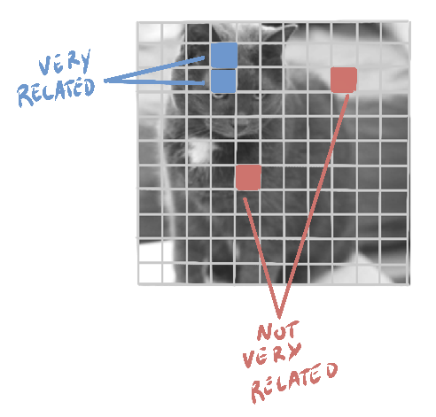

# Convolutional Neural Networks

---
layout: image-right
image: image-16.png
---

## Image Classification w/ Neural Networks

Neural networks have many applications, but image classification is among the most impactful.

Frank Rosenblatt’s perceptron machine showed promise but never realized his dream beyond simple shapes.

Just as our eyes are specialized for vision, image classification requires a specialized neural network.

---
layout: image-right
image: image-6.png
backgroundSize: contain
---

## An Image as Layers

A 28x28 pixel gray-scale image can be thought of as a 28x28 matrix of brightness values.

- 0 is black
- 255 is white ($2^8-1$)

In color, each pixel is three values (<b>RGB</b>).

- (255, 0, 0) is red
- (255, 255, 0) is yellow
- (255, 255, 255) is white

We now think of our 28x28 image as a 28x28x3 **tensor**. We call each color matrix a **channel**.

---
layout: image-right
image: image-15.png
backgroundSize: contain
---

## Tensor Basics

A **tensor** is a generalization of a matrix to N-dimensional space.

- A 1D tensor is a vector `[1, 2, 3, 4]`
- A 2D tensor is a matrix `[[1, 2], [3, 4]]`
- A 3D tensor is a cube of numbers `[[[1, 2], [3, 4]], [[5, 6], [7, 8]]]`

In CNNs, we work with 3D tensors: width, height, and depth (channels).

But there's nothing stopping us from working with 4D, 5D, or bigger tensors!

**This is where the popular library TensorFlow gets its name!**

---
layout: image-right-invert
image: image-1.png
backgroundSize: contain
---

## Fully Connected Networks

Fully connected networks are bad at images.

- Every neuron connects to every neurons in the next layer (exponential in parameters).
- Input size (224×224 = 50,176 pixels) makes a fully connected layer parameter-heavy.
- It ignores the spatial structure of images!

{width=60%}

---
layout: cover
background: image-12.png
---

**"Good artists copy, great artists steal"**

~ Pablo Picasso

---
layout: image-right
image: image-11.png
backgroundSize: contain
---

## Saccadic Eye Movements

- Quick, rapid eye movements shifting focus to efficiently gather visual information.

- Eyes capture detailed snapshots, stitched together by the brain to build a complete perception.

- Focuses attention on key features (edges, faces, movement) based on importance and context.

- Enables rapid identification of objects and patterns.

- Selectively processes relevant details, improving cognitive efficiency.

---
layout: image-right
image: image-13.png
backgroundSize: contain
---

## Convolutional Neural Networks

CNNs are neural networks that specialize in processing visual data.

They have three main components:
1. **Local receptive fields** (a.k.a. *convolution filters* or *kernels*)
2. **Shared weights** across different image positions
3. **Pooling** (subsampling) to reduce spatial dimensions

---
layout: image-right-invert
image: image-2.png
backgroundSize: contain
---

## Convolution Operation

- A small filter (e.g., 3×3) slides over the image
- At each location, do element-wise multiplication with the local patch → sum up
- Output is a “feature map” that highlights if that filter’s pattern is found there

**Example:** a *vertical edge* filter, a *horizontal edge* filter, etc.

_This is similar to the saccadic eye movements we discussed earlier!_

---
layout: image-right
image: convolution.gif
backgroundSize: contain
---
## <b>1</b> Convolution Operation

We define a small filter that slides over the image.

At each location, we compute the dot product of the filter and the image patch.

The output is a feature map that highlights where the filter pattern is found.

### Stride
Controls how far we move the filter each step.

### Padding
Zeros added to keep the output size the same.

---
layout: image-right-invert
image: image-14.png
backgroundSize: contain
---

## <b>2</b> Shared Weights

Instead of each pixel having unique weights, a single filter’s weights are **re-used** across all positions.

This greatly reduces parameter count!

Each filter is basically a learned “pattern detector.”

Each channel (RGB or grayscale) is also taken into account; we have multiple feature maps.

---
layout: image-right-invert
image: image-8.png
backgroundSize: contain
---

## <b>3</b> Pooling

**Pooling** is a technique used to reduce the spatial dimensions of the input.

- e.g. **Max Pool** with 2×2:
  - Slide a 2×2 window, take the max value in that region
  - Halves the width & height (if stride=2)
- Achieves **downsampling** → reduces computational load & overfitting
- Introduces some translation invariance

---
layout: image-right-invert
image: image-9.png
backgroundSize: contain
---

## CNN Architecture Example

Common pattern:
1. **Conv** (3×3) + ReLU
2. **Pool** (2×2)
3. Another **Conv** + ReLU
4. Another **Pool**
5. Flatten to vector
6. **Fully connected** layer(s)
7. Output

**Early** CNN references: LeNet-5 (Yann LeCun) for digit recognition in the 1990s.

---
layout: header-link
---

## Exercise: Your First CNN

[bigd103.link/cnns](https://bigd103.link/cnns)