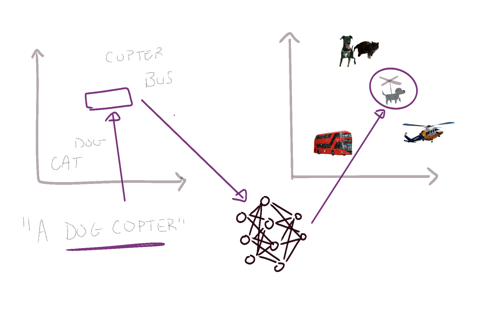

# Image Generation

---
layout: image-right
image: image-15.png
backgroundSize: contain
class: smaller-text
---

## AlignDraw (2015)

Researchers at the University of Toronto introduced an early text-to-image model called **AlignDRAW**.  
- **Key Idea**: The model could iteratively refine generated images by “drawing” one part at a time.
- **Data Requirements**: It was trained on a dataset of images paired with text captions.  
- **Goal**: Learn to produce images that correspond to their associated text descriptions.

 

> Example Text Prompt: “A stop sign is flying in blue skies”

---
layout: image-right
image: image-16.png
backgroundSize: contain
---

## Generation Stages

1. **Text Encoder**  
   - Converts the input text (prompt) into a latent representation or vector.

2. **Generator**  
   - Translates the text-encoding vector into an initial image (often low-resolution or noisy).

3. **Diffusion (Refinement)**  
   - Iteratively denoises or refines the generated image, making it more realistic over multiple steps.

---
layout: image-right
image: nlp-3.png
backgroundSize: contain
---

## Word Embeddings

- Word embeddings are dense, low-dimensional vectors.
- They capture semantic relationships between words.
- Words with similar meanings have embeddings that end up being close together.

$$
\begin{align}
  \text{Embedding}(\text{"dog"}) &= \begin{bmatrix}
         x_{1} \\
         x_{2} \\
         \vdots \\
         x_{m}
       \end{bmatrix}
\end{align}
$$

---
layout: image-right
image: nlp-4.png
backgroundSize: contain
---

## Comparing Word Vectors

### Semantic Similarity
Words that appear in similar contexts tend to have similar vector representations.

### Distance Between Word Vectors

$\text{dist}(\text{dog}, \text{puppy}) < \text{dist}(\text{dog}, \text{car})$

### Simple Vector Arithmetic
$\text{king} - \text{man} + \text{woman} \approx \text{queen}$

---
layout: center
transition: fade
---

{class="invert-when-dark-mode" style="width: 100%"}

---
layout: center
transition: fade
---

{class="invert-when-dark-mode" style="width: 100%"}

---
layout: center
transition: fade
---

{class="invert-when-dark-mode" style="width: 100%"}

---
layout: center
transition: fade
---

{class="invert-when-dark-mode" style="width: 100%"}

---
layout: center
transition: fade
---

{class="invert-when-dark-mode" style="width: 100%"}

---
layout: image-right
image: bananelemons.gif
backgroundSize: contain
---

## Diffusion Models

**Diffusion** refers to a popular class of generative models used to refine images:

**Training Phase**  
- Take real images and incrementally add noise.
- Train the model to reverse this process by removing the noise and reconstructing the original image.

**Inference (Generation)**  
- Start from a noisy or rough image.
- The model repeatedly applies “denoising” steps to create a realistic final image.

---
layout: two-cols
---

## Text-to-Image Generation

**Text-to-Image**: The process of generating an entirely new image from a textual prompt.

1. **Input**: A descriptive text prompt (e.g., “A futuristic city skyline at sunset”).  
2. **Model Output**: An image that attempts to accurately capture the description.  
3. **Examples of Systems**: DALL·E, Midjourney, Stable Diffusion, etc.

::right::

## Image-to-Image Generation

**img2img**: Generation of a new image using both a text prompt *and* a base image as input.

1. **Input**: A text prompt describing how you want to transform or refine the base image. Sometimes an initial or “seed” image, sometimes just a rough sketch.
2. **Transformation**: The model refines or alters the base image according to the text prompt, preserving some original structure while adding details and style.
3. **Example**: Converting a simple cat sketch into a realistic-looking cat.

---
layout: two-cols-header-2
---

## Image-to-Image Generation

::left::

{width=90%}

::right::

{width=90%}

---
layout: image-right
image: image-24.png
backgroundSize: contain
---

## DreamBooth

A specialized fine-tuning technique for personalized image generation.

- **Purpose**:   Customize a model to accurately generate images of a **specific subject**.
- **Process**:
  1. Collect a **small set** of images (often 5–20) showcasing the subject.  
  2. **Fine-Tune** the model on these images so it learns to represent the subject.  
  3. Use text prompts to generate new images of that subject in different styles or scenarios.

---
class: smaller-text
---

## Slide 7: LoRAs (Low-Rank Adaptation)

A technique to adapt large, pre-trained diffusion models to new tasks or styles with minimal computational cost and data.

**Motivation**:  
- Traditional fine-tuning can be expensive, requiring all model parameters to be updated.
- LoRAs insert small, trainable components (“adapters”) into the model, leaving the bulk of the model frozen.

**Process**:
1. **Insert Low-Rank Adapters** into specific layers of the model.  
2. **Train** only those adapters while keeping the original model weights fixed.  
3. The model learns new “styles” or “concepts” without overfitting or large resource demands.

**Result**:

Rapid style adaptations that are easy to share (since the adapters are lightweight files).

---
layout: image-right
image: image-6.png
backgroundSize: contain
---

## The 'Completely Full Wine Glass' Challenge

- **Problem**:  
  - Generating images of a "full wine glass" is easy.
  - Generating images of a "completely full wine glass" is hard.

- **Question**:
    - Why is this so difficult?
    - What does this tell us about generative transformers?

_**Note:** This was no longer true for OpenAI's 4o Image Generation released March 2025_

---
layout: header-link
hideInToc: true
---

# Try Stable Diffusion in Colab

https://github.com/woctezuma/stable-diffusion-colab
