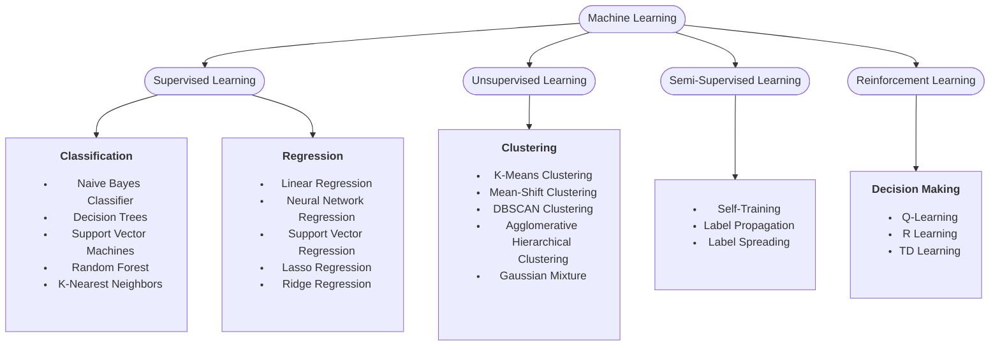
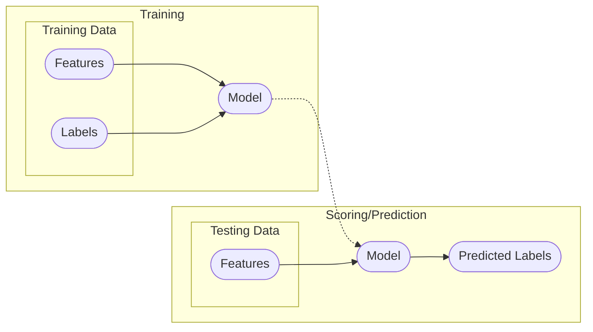
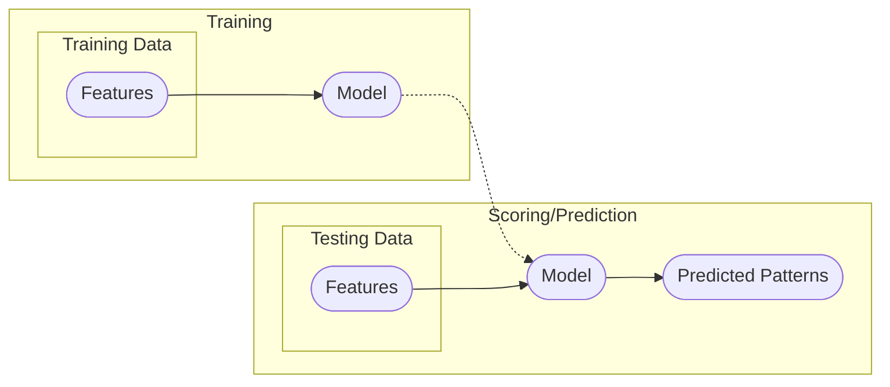
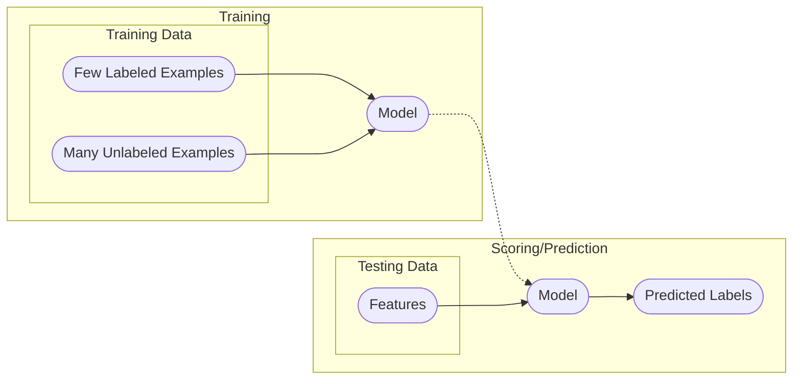
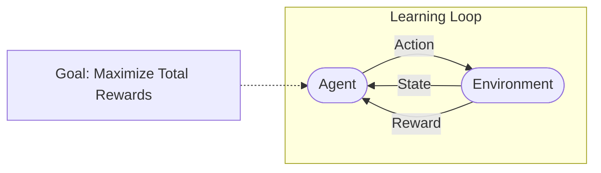
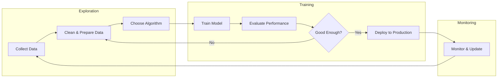

# DoNow

[bigd103.link/wsj-youtube](https://bigd103.link/wsj-youtube)

---
layout: cover
---

# Intro to Machine Learning

---
layout: section
---

### But first, **what is Machine Learning?**

---
layout: center
---

> Machine learning is a subfield of computer science that focuses on building algorithms that rely on a collection of examples of some phenomenon. These examples may come from nature, be handcrafted by humans, or generated by another algorithm.

*The Hundred-Page Machine Learning Book*

---

## Types of Learning

### Supervised Learning
The dataset is a collection of labeled examples.

### Unsupervised Learning
The dataset is a collection of unlabeled examples.

### Semi-Supervised Learning
The dataset includes both labeled and unlabeled examples.

### Reinforcement Learning
The machine interacts with an environment to maximize rewards.

---

## Types of Learning

_This class will focus on **Supervised Learning** and **Unsupervised Learning** as those are the most common._

---
layout: image-right
image: image-1.png
---

## Supervised Learning

Your "training" dataset is composed of examples of labeled examples:
  - $X$ - features
  - $Y$ - labels

A supervised learning model learns to predict the label $Y$ from the features $X$.

---
layout: image-right
image: image-2.png
backgroundSize: contain
---

## Unsupervised Learning

Your "training" dataset is composed of examples of unlabeled examples:
  - $X$ - features
An unsupervised learning model learns to find patterns in the features $X$.
 

---

## Supervised vs Unsupervised Learning

---
layout: image-right
image: image-3.png
backgroundSize: contain
transition: fade
---

## Semi-Supervised Learning

Your "training" dataset contains:
- A **small** set of labeled examples: $(X_L, Y_L)$
- A **large** set of unlabeled examples: $X_U$

The model learns from both labeled and unlabeled data to improve predictions.

---
layout: image-right
image: image-3.png
backgroundSize: contain
---

## Semi-Supervised in Action

- **Google Photos**
  - **Initial Setup**: You label a few faces
  - **After**: Automatically groups all photos of that person
  - Combines your labels with facial clustering
- **YouTube Auto-Captions**
  - **Some videos**: Human-transcribed (labeled)
  - **Most videos**: Auto-generated using both labeled and unlabeled audio

---
layout: image-right
image: image-4.gif
backgroundSize: contain
transition: fade
---

## Reinforcement Learning

The model (agent) learns through **trial and error** by:
- **State** $(S)$: What the agent observes
- **Action** $(A)$: What the agent can do  
- **Reward** $(R)$: Feedback for actions taken

The agent learns a policy $\pi(S) \rightarrow A$ to maximize cumulative rewards.

---
layout: image-right
image: image-4.gif
backgroundSize: contain
---

## Reinforcement Learning in Action

- **Google Maps Route Suggestions**
  - **Action:** Suggest route
  - **Reward:** User selects route
  - **Learns:** Traffic patterns and user choices
- **TikTok's "For You" Page**
  - **Action:** Show video
  - **Reward:** Watch time, likes, shares
  - **Learns:** What keeps you scrolling

---

## The ML Pipeline

Most real-world ML systems follow this workflow:

---

## Before We Dive Into Algorithms...

### Key Questions to Ask:
1. **What type of problem is it?**
   - Classification, Regression, Clustering, etc.
2. **What data do we have?**
   - Labeled? Unlabeled? How much?
3. **What's our goal?**
   - Accuracy? Speed? Interpretability?
4. **What are the constraints?**
   - Computing power? Real-time requirements?

These questions determine which algorithm to use!