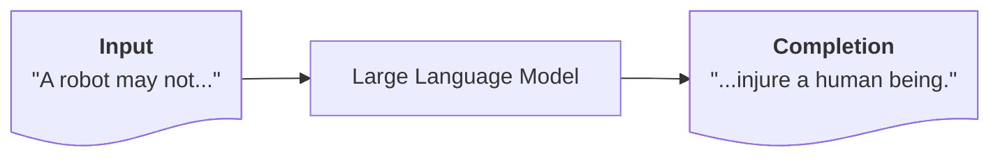

# Large Language Models

---
layout: section
---

## Small Language Models

---
layout: image-right
image: image-4.png
backgroundSize: contain
---

## Markov Chains

A mathematical system that transitions from one state to another, assuming the probability of moving to the next state depends only on the current state (the **Markov property**).

### In Language Modeling
- Each *state* is a word/token
- A **transition** represents the probability of the next token given the current one (or the last few).
- By training on a corpus, we learn transition probabilities between tokens.
- **We can then generate new sequences by sampling from these probabilities.**

---
layout: two-cols-header-2
---

## Markov Chains Example

::left::

```python
word_list = ["I", "am", "a", "student", "I", "am",
    "learning", "Python"]
transitions = {}

# Training

# 1. Populate the transitions dictionary with counts
for i in range(len(word_list) - 1):
    current_word = word_list[i]
    next_word = word_list[i + 1]
    if current_word not in transitions:
        transitions[current_word] = {}
    if next_word not in transitions[current_word]:
        transitions[current_word][next_word] = 0
    transitions[current_word][next_word] += 1

# 2. Convert counts to probabilities
for current_word, next_words in transitions.items():
    total = sum(next_words.values())
    for next_word in next_words:
        transitions[current_word][next_word] /= total
```

::right::

```python

# Prediction

# Generate a sequence of words
def generate_sequence(start_word, length):
    sequence = [start_word]
    current_word = start_word
    for _ in range(length - 1):
        current_word = next_word(current_word)
        sequence.append(current_word)
    return sequence

start_word = "When"
length = 20
sequence = generate_sequence(start_word, length)
song = " ".join(sequence)
print("Generated sequence:", song)
```

---
layout: header-link
---

## Exercise: Markov Chains

[bigd103.link/markov-chains](https://bigd103.link/markov-chains)

---
layout: iframe
url: https://filiph.github.io/markov/
---

<!-- demonstration of a markov chain trained on Trump's tweets -->

---
layout: image-right
image: autocomplete.gif
backgroundSize: contain
---

## Using Markov Chains

### Uses
- Predictive text (auto-complete).
- Search suggestions.
- Code completion.
- Generating semi-coherent nonsense.
- Any simple text generation task

### Shortcomings as a Language Model
- They miss **long-range** relationships
- They miss **meaning** of words/tokens
- They miss **context** of the token and how it's being used.

---

## What Are Large Language Models (LLMs)?

A large language model is a token prediction system that attempts to:

1. Manage **long-range** relationships in text.
2. Understand the **meaning** of words/tokens.
3. Understand the **context** of the token within some range of text.

The goal is for the LLM to complete a text sequence in a way that is **coherent** and **contextually relevant**.

<br>



In practice, LLMs are neural networks with **billions** of parameters trained to predict the next token in a text sequence and the foundation of what we think of as "AI" today.

---
layout: image-right
image: image-9-2.png
backgroundSize: contain
class: smaller-text
---

## 1. Longer-Range via RNNs

Neural networks typically outperform Markov chains in predictive tasks. RNNs were the first models to effectively predict sequences token-by-token by reusing hidden states.

- **Vanilla RNN**:
    - Each step: $h_t = f(h_{t-1}, x_t)$
    - Learns to carry forward info
- **LSTM**:
    - Adds gating mechanisms to the RNN
    - Better at capturing **long-term** dependencies
    - Still not perfect with *very* long sequences

RNNs improved upon Markov chains by letting the model **remember** more than a few tokens.

---
layout: two-cols-header-2
---

## RNN-Based Language Modeling

::left::

**Training**:
1. Convert words/tokens to numeric IDs.
2. Feed them one by one into RNN cells.
3. Model predicts the next token at each step.
4. Compare prediction vs. ground truth (loss).
5. Update weights via backpropagation.

**Scoring**
1. Given a sequence, feed it to the model.
2. The model predicts the next token at each step.

<br>

::right::

```python
import torch
import torch.nn as nn

class SimpleRNN(nn.Module):
    def __init__(self, vocab_size, embed_dim, hidden_dim):
        super().__init__()
        self.embed = nn.Embedding(vocab_size, embed_dim)
        self.rnn = nn.RNN(embed_dim, hidden_dim, batch_first=True)
        self.fc = nn.Linear(hidden_dim, vocab_size)

    def forward(self, x):
        x = self.embed(x)
        out, h = self.rnn(x)
        logits = self.fc(out)  # [batch, seq_len, vocab_size]
        return logits
```

---
layout: image-right
image: image.png
backgroundSize: contain
class: smaller-text
---

## 2. Meaning of Words via Word Embeddings

For RNNs to work efficiently, we need to convert words to dense vectors. Algorithms like **Word2Vec** learn these embeddings from large text corpora.

#### Benefits of Word Embeddings

**Semantic relationships**: Words with similar meanings are close in the embedding space.

**Syntactic relationships**: Words with similar grammatical roles are directionally similar.

**Vector arithmetic**: We can perform operations on embeddings to capture relationships.

$$
\text{embed}("king") + -\text{embed}("man") + \text{embed("woman")} \approx \text{embed}("queen") 
$$

---
layout: center
---


---
layout: section
hideInToc: true
---

# 3. Contextual Understanding

## via Transformers

---
layout: image-right
image: image-1.png
backgroundSize: contain
---

## Attention Is All You Need (2017)
<p class="subheading">Ashish Vaswani, Noam Shazeer, Niki Parmar, Jakob Uszkoreit, Llion Jones, Aidan Gomez, Łukasz Kaiser, and Illia Polosukhin</p>

Introduced the **Transformer** architecture, replacing recurrence with **self-attention**.

**Key Findings**:
- Self-attention is better than recurrence to capture long-range dependencies.
- We can parallelize computation across tokens.

This was a breakthrough leading to the development of large-scale language models like GPT-3.

---
layout: image-right-invert
image: image-5.png
backgroundSize: contain
---

## Transformer Architecture

### Self-Attention
- Each token attends to *every other* token
- Captures relationships no matter how *far* apart

### Multi-Head
- Multiple attention “heads” to learn different relationships

### Positional Encoding
- So the model knows the order of tokens

**GPT** (Generative Pretrained Transformer) uses a **decoder-only** Transformer to predict the next token, allowing it to handle longer contexts than RNNs or Markov chains.

---
layout: image-right
image: image-2.png
---

## Context Matters

Imagine two different sentences:

1. **"The <u>newfoundland</u> ran through the park."**  

2. **"I traveled to <u>newfoundland</u> last summer."**  

The embedding for `"newfoundland"` starts the same in both sentences.

### Goal

Our model should update the vector based on context.

**Transformers** solve this by letting each word "look at" (attend to) surrounding words. 

---
layout: two-cols-header-2
---

## A Quick Overview of Self-Attention

::left::


We start with the initial embeddings $x_i$ for each token in the sequence:<br>(e.g., `"The"`, `"newfoundland"`, `"ran"`, ...).

### Projection

The transformer has three weight matrices:<br>($W_Q$, $W_K$, $W_V$)

Using these, each token embedding $\mathbf{x}_i$ is transformed into three vectors:
- **Query**: $\mathbf{q}_i = \mathbf{x}_i W_Q$
- **Key**: $\mathbf{k}_i = \mathbf{x}_i W_K$
- **Value**: $\mathbf{v}_i = \mathbf{x}_i W_V$

::right::

### Similarity Score

For token $i$, we compare its **query** $\mathbf{q}_i$ with every other token’s **key** $\mathbf{k}_j$.

The dot product $\mathbf{q}_i \cdot \mathbf{k}_j$ measures how relevant token $j$ is to token $i$.

$$
\text{score}_{ij} 
= \frac{\mathbf{q}_i \cdot \mathbf{k}_j}{\sqrt{d_k}}
$$

Where $d_k$ is the dimensionality of the key vectors (for normalization).

---
layout: center
---

{class=invert-when-dark-mode}

---
layout: center
---

{class=invert-when-dark-mode}

---

## Turning Scores into Weights

### Softmax and Weighted Sum

We then convert the raw scores $\text{score}_{ij}$ into probabilities that sum to 1 using a **softmax** function:

$\alpha_{ij} = \text{softmax}\Bigl(\frac{\mathbf{q}_i \cdot \mathbf{k}_j}{\sqrt{d_k}}\Bigr)$ = “attention weight” of token $j$ on token $i$.

$\mathrm{Attention}_i = \sum_{j} \alpha_{ij} \, \mathbf{v}_j$ = a **blend** of other tokens’ **value** vectors, weighted by $\alpha_{ij}$.

### Intuition
- If "**dog**", "**breed**", or "**ran**" appear near `"newfoundland"`, they will have higher attention weights and push $\mathbf{v}_j$ into the dog embedding space.
- If "**traveled**", "**province**", or "**summer**" appear, the model will weigh those more, guiding `"newfoundland"` toward the location embedding space.


---
layout: image-right
image: image-6.png
backgroundSize: contain
---

## Multi-Head Attention

In practice, instead of a single attention mechanism, **multi-head attention** runs multiple attention “heads” in parallel, each with their own specialized $W_Q$, $W_K$, and $W_V$ matrices. Each head can learn different contextual cues:

- **Head 1** focuses on verb tense or grammar.
- **Head 2** focuses on type (dog, place, etc.)
- **Head 3** tracks numerical or quantity info.
  
At the end, they’re concatenated, giving a richer representation.

**GPT-3 uses 96 attention heads in its transformer architecture.**

---
layout: center
---


---
layout: center
---


---
layout: image-right
image: image-7.png
backgroundSize: contain
---

## Temperature for Softmax

When sampling the next token, we have:

$$
\text{probs} = \mathrm{softmax}\Bigl(\frac{\text{logits}}{T}\Bigr)
$$

- **$T$ = Temperature**:
  - **Low** (e.g. 0.1): More deterministic (safe or “repetitive”).
  - **Medium** (e.g. 0.7): Balanced creativity.
  - **High** (e.g. 1.5): Very creative (sometimes nonsense).

A simple tweak to temperature can drastically change the style of LLM outputs (similar to Markov chain *randomness*, but more sophisticated).

---
layout: two-cols-header-2
---

## Markov Chains w/ Temperature

::left::

```python
from math import log, exp
from random import choices

def next_word(current_word, temp=1.0):
    if current_word not in transitions:
        return random.choice(list(transitions.keys()))
    probabilities = transitions[current_word]
    next_words = list(probabilities.keys())
    pvals = list(probabilities.values())
    # Convert probabilities to logits
    logits = [log(p) for p in pvals]
    # Scale logits by the temp
    scaled_logits = [logit/temp for logit in logits]
    # For stability, subtract the maximum scaled logit
    max_logit = max(scaled_logits)
    exps = [exp(s - max_logit) for s in scaled_logits]
    sum_exps = sum(exps)
    # Compute the softmax probabilities
    softmax_probs = [exp_val/sum_exps for exp_val in exps]
    # Choose next word using temp-adjusted probabilities
    return choices(next_words, weights=softmax_probs)[0]
```

::right::

```python
song = " ".join(generate_sequence("When", 20, temp=0.1))
print("Generated sequence with temp 0.1:\n", song, "\n")
```

> When I know that I know that I was a little thing that I know that I don't know that 

<br>

```python
song = " ".join(generate_sequence("When", 20, temp=0.5))
print("Generated sequence with temp 0.5:\n", song, "\n")
```

> When I don't know you know I can do I see And the river to the light in the time 

<br>

```python
song = " ".join(generate_sequence("When", 20, temp=1.0))
print("Generated sequence with temp 1:\n", song, "\n"
```

> When are melting Little darling, I feel more And if I was very slow (In control) For our troubles And 


---
layout: two-cols
---

## Simple ChatGPT-like Bot

**Setup**:
1. `pip install openai`
2. Set your API key.
3. Create a client.

**Create a Response**:
1. Append the user query to the Gopher prompt as if it were the next thing User said.
2. Generate some number of tokens (e.g., 50) of more conversation between Gopher and User.
3. Extract the first response by Gopher's in the generated conversation ignoring User's response.

::right::

```python
from openai import OpenAI

GOPHER_PROMPT = "..."

def get_response(query):
    client = OpenAI(api_key="...")
    completions = client.completions.create(
        model="babbage-002", # A non-chatbot LLM text-completion model
        prompt=GOPHER_PROMPT + "User: " + query, # Append the user query
        max_tokens=50,
        temperature=0.8
    )
    # Choose the first generated conversation
    response = completions.choices[0].text

    # Extract Gopher's generated response
    response = response.split("Gopher: ")[1]

    # Remove User's response
    response = response.split("User:")[0]

    return response

get_response("what is the first law of robotics?")
```

---
layout: image
image: image-10.png
backgroundSize: contain
---

---
layout: image
image: image-11.png
backgroundSize: contain
---

---
layout: image-right
image: image-8.png
backgroundSize: contain
---

## Gopher Paper Prompt

The prompt the LLM a story about two characters:k

- **Gopher:** The helpful assistant.
- **User:** The person interacting with Gopher.

1. We "prompt" the LLM with the first part of the story between Gopher and the User.
2. A question is asked and filled into the "**User:**" section of the story.
3. The LLM continues the story from there for both Gopher and User. Gopher's next response is the answer to our question.

_Modern LLMs refer to Gopher as "System"._

---
layout: image-right
image: image-9.png
backgroundSize: contain
---

## Who is the AI?<br>Gopher or the Observer?

LLMs are just **pattern completers**: They continue text in a coherent way.

By providing a *role prompt* (the Gopher style):
- We set the **context** they will “roleplay.”
- We guide them to produce more structured, step-by-step answers.
- We encourage honesty & disclaimers.

This is how prompting can approximate an interactive AI.

But the Observer, the LLM, doesn't know who Gopher or User are. They don't know they're an AI. They're just predicting the next token.

---
layout: header-link
---

## Exercise: Build a Chat AI

https://shorturl.at/4AVMk

TODO