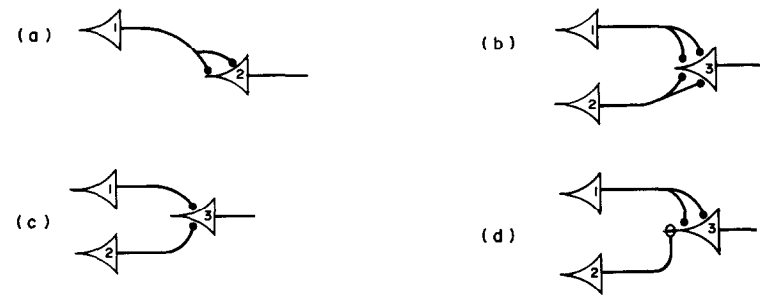
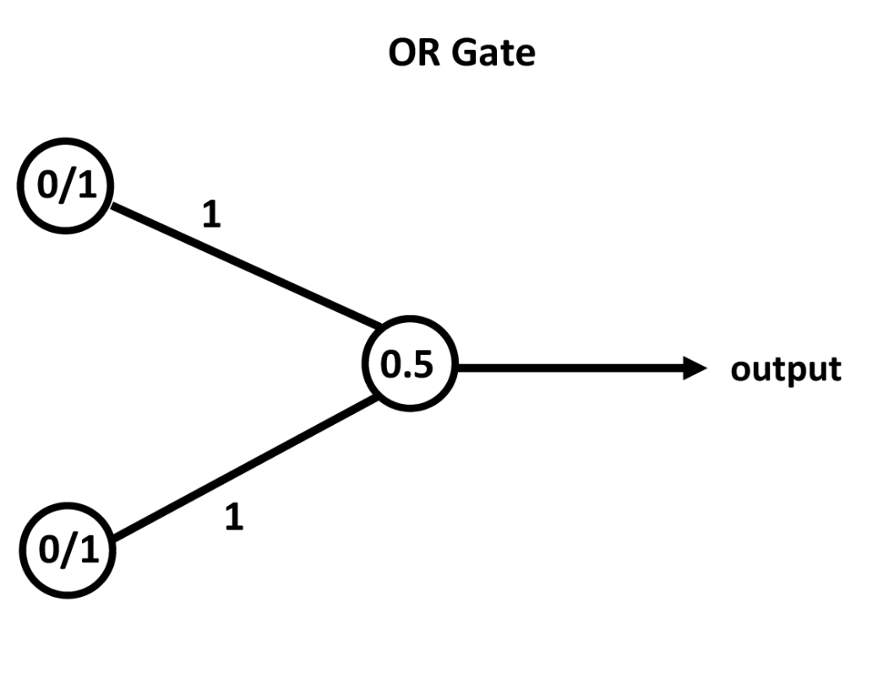
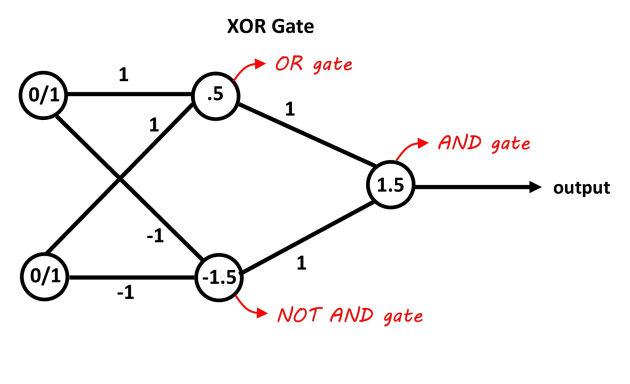
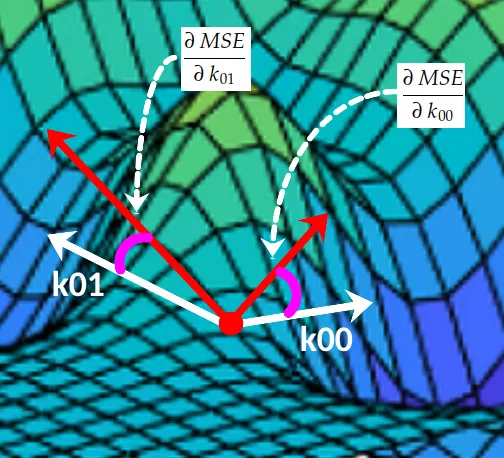

# Neural Networks

---
layout: image-right
image: image-37.png
backgroundSize: contain
class: smaller-text
---

## Functions

A **function** from set $X$ to set $Y$ assigns some input of $X$ exactly one element of $Y$.

The set $X$ is called the **domain** of the function and the set $Y$ is called the **codomain** of the function.

### In Math

$f(x) = mx + b$, where $f$ maps $X$ to $Y$.

### In Code

```python
def f(x):
    return mx + b
```

---
layout: image-right-invert-light
image: image-38.png
backgroundSize: contain
---

## Machine Learning as Function Approximation

In machine learning, we often want to learn a function $f$ that maps inputs $X$ to outputs $Y$.

This is known as **function approximation**.

### Example

- **Input:** A set of features, $X$, describing a house (size, location, age).
- **Output:** The price of the house, $Y$.
- **Goal:** Learn a $f$ such that $f(X) \approx Y$.


---
layout: image-right
image: image-21.png
---

## The Universal Approximator

The brain is a **universal approximator** is something capable of approximating almost any function. It can learn to recognize faces, understand speech, and master complex skills.

At its core, the brain continuously approximates complex patterns and relationships from vast amounts of data (sensory inputs).

Can we build machines that approximate the brain’s capabilities?

---
layout: image-right
image: image-22.png
backgroundSize: contain
class: smaller-text
---

## How the Brain Does It

- Neurons receive electrical/chemical signals through branching dendrites, forming connections (synapses) with other neurons.

- Incoming signals are summed in the neuron's cell body; if the total exceeds a threshold, the neuron fires an action potential (an electrical pulse).

- Action potential travels along the axon, signaling connected neurons downstream.

- Synapses adapt over time—this adaptability underpins learning.

- The neuron's firing behavior enables brains to learn, adapt, and encode complex patterns.

---
layout: cover
background: image-23.png
---

<center>

**"Good artists copy, great artists steal"**

~ Pablo Picasso

</center>


---
layout: image-right
image: image.png
class: smaller-text
---
## 1943

### Warren McCulloch & Walter Pitts

Proposed earliest formal models of the neuron as a <span v-mark.yellow="{at: 0, type: 'highlight'}">threshold unit</span> in '**A Logical Calculus of the Ideas Immanent in Nervous Activity**', laid the conceptual groundwork by showing that networks of such <span v-mark.yellow="{at: 0, type: 'highlight'}">“binary neurons”</span> could, in principle, perform logical computations.



This hinted at how **biological neurons could be approximated by mathematical functions**.

---
layout: image
image: image-12.png
---

<!-- Image of a neuron vs a perceptron -->

---
layout: image-right
image: image-1.png
---

## 1958

### Frank Rosenblatt’s Perceptron

At Cornell, Rosenblatt built on the threshold unit concept to develop the <span v-mark.yellow="{at: 0, type: 'highlight'}">**Perceptron**</span>, describing it as:

> “the first machine which is capable of having an original idea”

In practice, the perceptron was an algorithm that could adjust its weight parameters to classify input patterns (e.g., simple images).

---
layout: image-right
image: image-32.png
backgroundSize: contain
---

## The Perceptron

A single-layer binary classifier
- Inputs $\mathbf{x} = (x_1, x_2, \dots, x_n)$
- Weights $\mathbf{w} = (w_1, w_2, \dots, w_n)$
- Bias $b$

### Activation Function

- If the weighted sum exceeds the threshold, $b$, the output is 1.
- Otherwise, the output is 0.

$$
\text{output} =
\begin{cases}
0, & \text{if } \sum_j w_j x_j + b \leq 0, \\
1, & \text{if } \sum_j w_j x_j + b > 0.
\end{cases}
$$

---
layout: image
image: image-17.png
backgroundSize: contain
---

<!-- Diagram of the perceptron activating with a step-function -->
<!-- TODO replace this with better art -->

---
layout: image
image: image-15.png
backgroundSize: contain
---

<!-- Diagram of the Mark-1 perceptron scoring a photo -->


---
layout: image-right
image: image-13.png
backgroundSize: contain
---

## Perceptron Learning Algorithm (Simplified)

1. Initialize $\mathbf{w}, b$ to small random values (or zeros)
2. For each training example:
   - Predict output using $\mathbf{w}$ and $b$
   - If the prediction is correct, do nothing
   - If incorrect, **update**:
     $$
       \mathbf{w} \leftarrow \mathbf{w} + \eta \cdot (y_{\text{true}} - y_{\text{pred}})\,\mathbf{x}
     $$
     $$
       b \leftarrow b + \eta \cdot (y_{\text{true}} - y_{\text{pred}})
     $$
3. Repeat until no errors or max iterations


---
layout: cover
background: mark-1.png
---

**"[it is] the first machine which is capable of having an original idea. [it will] walk, talk, see, write, reproduce itself and be conscious of its existence."**

**~ Frank Rosenblatt, 1958**

---
layout: image-right
image: image-16.png
---

## 1960s

### Sigmoid Activation

- While single-layer perceptrons were popular, to add layers, researchers needed a **smooth, differentiable activation function**.

- Early experiments showed that replacing the step function with a **sigmoid** or **logistic** function could allow for gradient calculations.

- This insight paved the way for *backpropagation* because differentiability was required to compute partial derivatives of the network’s parameters.

---
layout: image-right
image: image-9-2.png
backgroundSize: contain
---

<!--
Images:
- The image is a graph of the logistic function.
-->

## Logistic Regressions

Logistic regression models the probability of a binary outcome by applying the **sigmoid (logistic) function** ($\sigma$) to a linear combination of input features ($x_j$) and learned weights ($w_j$):

$$
P(y=1 \mid x) = \sigma(\sum_j w_j x_j) \\
\sigma(z) = \frac{1}{1 + e^{-z}}
$$

The sigmoid function maps any real value to the a continuous value in the range $[0, 1]$.

This allows us to learn a model that maps a large range of inputs into a binary outcome.

---
layout: image-right
image: image-18.png
backgroundSize: contain
---

## Sigmoid Perceptron

The original perceptron used a step activation function, making binary ("fire or not") decisions. But the step function isn’t differentiable, which prevents gradient-based optimization.

A sigmoid perceptron replaces the step activation with a smooth, continuous **sigmoid function**:

$$
\text{output} =
\begin{cases}
0, & \text{if } \sum_j \sigma(w_j x_j + b) \leq 0, \\
1, & \text{if } \sum_j \sigma(w_j x_j + b) > 0.
\end{cases}
$$

The sigmoid function is **differentiable**, meaning weights can be updated using **gradient-based optimization** in training.

---
layout: image-right
image: image-3.png
class: smaller-text
---

## 1969

### Limits of Single-Layer Perceptrons

Marvin Minsky and Seymour Papert published '**Perceptrons**', which rigorously analyzed the mathematical capabilities and limits of single-layer perceptrons.

Their work famously demonstrated that certain problems (like the XOR) could not be solved by a single perceptron layer.

This finding had two major impacts:

1. It led to the first "AI Winter."
2. Disproving it for multi-layer networks led to the "Universal Approximation Theorem."

---
layout: image-right
image: image-25.png
backgroundSize: contain
---

## Linear Separability

A function is **linearly separable** if it can be separated into two classes by a straight line (or hyperplane).

<div class="grid grid-cols-2">

<div>

{class="invert-when-dark-mode"}

</div>
<div>

{class="invert-when-dark-mode"}

</div>
</div>

Because the perceptron uses a linear decision boundary, it can only solve linearly separable problems.


---
layout: image-right
image: image-26.png
backgroundSize: contain
---

## Multi-Layer Networks

Minsky and Papert showed that single-layer perceptrons have limitations.

However, they also demonstrated that **multi-layer networks** could solve non-linearly separable problems.

{class="invert-when-dark-mode"}

<!-- https://www.deep-mind.org/2023/03/26/the-universal-approximation-theorem/ -->

---
layout: cover
background: image-24.png
---

## Universal Approximation Theorem

A feedforward network with a single hidden layer, using a non-linear activation function, can approximate any continuous function on a compact domain, given sufficient hidden units.

---
layout: image-right
image: image-19.png
backgroundSize: contain
class: smaller-text
---
## 1986

### Multi-Layer Networks and Backpropagation

David Rumelhart, Geoffrey Hinton, and Ronald Williams described the **backpropagation** algorithm, showing how multi-layer networks could be trained by automatically computing partial derivatives of a cost function.

This method circumvented the limitations of single-layer perceptrons and revitalized neural network research, as it enabled efficient training of deeper (but small) networks.

This finally simulated the learning process of the human brain, where feedback signals adjust the strength of connections between neurons.

---
layout: image-right
image: neural_network.gif
backgroundSize: contain
---

## Training a Multi-Layer Network

1. **Forward Pass**:
   - Input $\to$ hidden layers $\to$ output
   - Evaluate “predictions”
2. **Loss (Cost) Function**:
    - MSE, Cross-Entropy, etc.
3. **Backpropagation**:
    - Compute partial derivatives w.r.t. each weight
    - Chain rule through layers
4. **Update** weights:
    - Gradient Descent / Adam / etc.

---
layout: image-right
image: gd.gif
backgroundSize: contain
---

## Gradient Descent

The goal of training a neural network is to minimize a **loss function** $L$ by adjusting the weights $\mathbf{w}$.

Gradient descent adjusts the weights in the opposite direction of the gradient of the loss function.

<center>

{width=50%}

</center>

Gradient Decent only guarantees it will find <u>**local minimum**</u>, like rolling a ball in a field.


---
layout: image-right
image: image-20.png
backgroundSize: contain
---

## 1989

### LeNet

The first neural network capable of identifying handwritten characters was designed by Yann LeCun and his colleagues at AT&T Bell Labs in Holmdel, New Jersey.

A dataset of numbers was obtained from the US Postal Service, and the network was trained to recognize handwritten digits.

LeNet had a 1% error rate. It was employed by the US Postal Service in the 90s to read zip codes on mail.

This was the first practical application of neural networks in the real world and finally realized Frank Rosenblatt's dream.

---
layout: two-cols
---

## Code Example: Multi-Layer Perceptron

- Use Keras (TensorFlow) to build a **feedforward neural network**.
- Train it on **MNIST** (handwritten digits) to recognize 0–9.
- Demonstrate **forward pass**, **loss**, **backprop**, and **gradient descent** in practice.

<br>

```python
import tensorflow as tf
from tensorflow.keras.models import Sequential
from tensorflow.keras.layers import Dense, Flatten
from tensorflow.keras.datasets import mnist
from tensorflow.keras.utils import to_categorical

# 1. Load data
(x_train, y_train), (x_test, y_test) = mnist.load_data()
```

::right::

```python
# 2. Normalize inputs (0-255 -> 0-1)
x_train = x_train / 255.0
x_test  = x_test / 255.0

# 3. One-hot encode labels
y_train = to_categorical(y_train)
y_test  = to_categorical(y_test)

# 4. Define MLP model
model = Sequential([
    Flatten(input_shape=(28,28)),   # Flatten 28x28 to 1D vector
    Dense(128, activation='relu'),  # Hidden layer
    Dense(64, activation='relu'),   # Another hidden layer
    Dense(10, activation='softmax') # Output layer for 10 classes
])

# 5. Compile & train
model.compile(optimizer='adam',
              loss='categorical_crossentropy',
              metrics=['accuracy'])

model.fit(x_train, y_train, epochs=5, batch_size=32)

# 6. Evaluate on test set
test_loss, test_acc = model.evaluate(x_test, y_test, verbose=0)
print("Test Accuracy:", test_acc)
```

---
layout: image-right
image: image-36.png
backgroundSize: contain
---

## ReLU Activation
<p class="subheading">A practical modification</p>

- The **Rectified Linear Unit (ReLU)** is a popular activation function that's largely replaced the sigmoid activaion.
- It's not differentiable at 0, but this rarely causes issues in practice.

ReLU is defined as:

$$
\text{ReLU}(x) = \max(0, x)
$$

_ReLU is faster to compute and gets better results than sigmoid so we're going to use it for our exercises._

---
layout: header-link
---

## Exercise: Your First Neural Network

[bigd103.link/neural-net](https://bigd103.link/neural-net)
