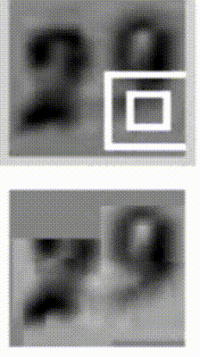

# Recurrent Neural Networks

---
layout: image-right
image: image-19.png
backgroundSize: contain
---

## Feedforward Neural Networks
<p class="subheading">Recap</p>

So far we've studied simple networks where information moves in one direction.

These networks are **one-to-one**. A single input produces a single output.

**Why are Feedforward Networks Limited?**

These do not capture spatial or sequential dependencies well.

To effectively process text, audio, or time series data, we need networks that can capture temporal dependencies.

---
layout: image-right
image: image-5.png
backgroundSize: contain
---
## Different Types of Neural Networks

**one-to-one**: Feedforward neural networks, classic image classification

**one-to-many**: Music generation, image captioning

**many-to-one**: Sentiment analysis, text classification

**many-to-many**: language translation

**many-to-many (synced)**: Video classification

---
layout: image-right
image: image-1.png
backgroundSize: contain
---

## Recurrent Neural Networks (RNNs)

**Purpose**: Designed to handle sequential data by maintaining a hidden state.

**Architecture**: Output from the previous step is fed as input to the current step using a hidden state.

  $h_t = f(W_h h_{t-1} + W_x x_t)$

**Where:**
- $h_t$: Hidden state at time $t$
- $x_t$: Input at time $t$
- $W_h$, $W_x$: Weight matrices
- $f$: Activation function

---
layout: image-right
image: image-6.png
backgroundSize: contain
---

## RNNs in Code

```python
class RNN:
  ...
  def step(self, x):
    # update the hidden state
    self.h = (
      np.tanh(np.dot(self.W_hh, self.h)
      + np.dot(self.W_xh, x)
    )
    # compute the output vector
    y = np.dot(self.W_hy, self.h)
    return y
```

<br>

```python
rnn = RNN() # trained on "hello"

x = np.array(...)  #  input "h"
y0 = rnn.step(x)   # output "e"
y1 = rnn.step(y0)  # output "l"
y2 = rnn.step(y1)  # output "l"
y3 = rnn.step(y2)  # output "o"
```

---
layout: two-cols
---



::right::

{width=100%}


---
layout: image-right
image: image-3.png
backgroundSize: contain
---

## Vanishing and Exploding Gradients

RNNs have two major issues when training on long sequences:

### Vanishing Gradients

Gradients become too small, preventing the network from learning long-term dependencies.

### Exploding Gradients

Gradients become too large, causing instability in training.

---
layout: image-right
image: image-7.png
backgroundSize: contain
---

## The Vanishing Gradient Problem

- Gradients shrink exponentially during backpropagation, especially with sigmoid activation.

- Multiplying small gradients layer-by-layer results in negligible weight updates.

- Prevents deep networks from capturing long-term dependencies:

$$
\begin{align*}
\frac{d}{dx}\bigl(f \bigl(g(h(x))\bigr)\bigr) 
&= \underbrace{f{\prime}(g(h(x)))}_{\text{small}}
\times \underbrace{g{\prime}(h(x))}_{\text{smaller}}
\times \underbrace{h{\prime}(x)}_{\text{tiny}} \\
&\approx 0
\end{align*}
$$

---
layout: image-right
image: image-8.png
backgroundSize: contain
---

## The Exploding Gradient Problem

- Gradients grow exponentially during backpropagation, often due to large weight values.  
- Multiplying large gradients layer-by-layer causes updates to blow up.  
- Leads to unstable training and potential divergence:

$$
\begin{align*}
\frac{d}{dx}\bigl(f \bigl(g(h(x))\bigr)\bigr)
&= \underbrace{f'(g(h(x)))}_{\text{large}}
\times \underbrace{g'(h(x))}_{\text{larger}}
\times \underbrace{h'(x)}_{\text{huge}} \\
&\approx \infty
\end{align*}
$$


---
layout: image-right
image: image-2.png
backgroundSize: contain
---

## Long Short-Term Memory (LSTM) Networks

LSTMs tackle the vanishing and exploding gradient problems by using a **gating mechanism** to selectively store, update, and retrieve information.

By selectively “remembering” and “forgetting,” LSTMs maintain context over long sequences.

- **Forget Gate**: decides what information to discard.
- **Input Gate**: decides what new information to store.
- **Output Gate**: decides what information to pass to the next layer.

---
layout: image-right
image: image-9.png
backgroundSize: contain
---

## Intuition Behind LSTMs

Think of LSTMs as having a built-in memory that decides which details to keep over time.
  
**Example:**

> <mark>Dave</mark>, as a result of <mark>his</mark> controversial claims, <mark>is</mark> now a pariah

The LSTM “remembers” Dave to link it with “his,” preserving context throughout the sentence.

LSTMs excel in tasks like machine translation, text summarization, and sentiment analysis—any place where long-range context is crucial.