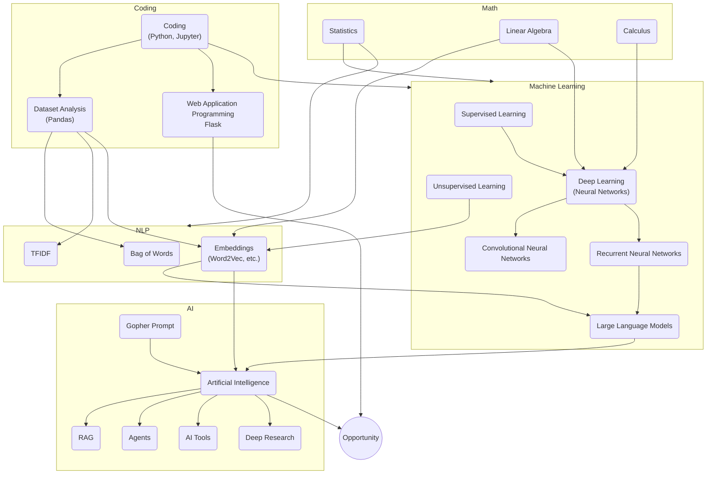
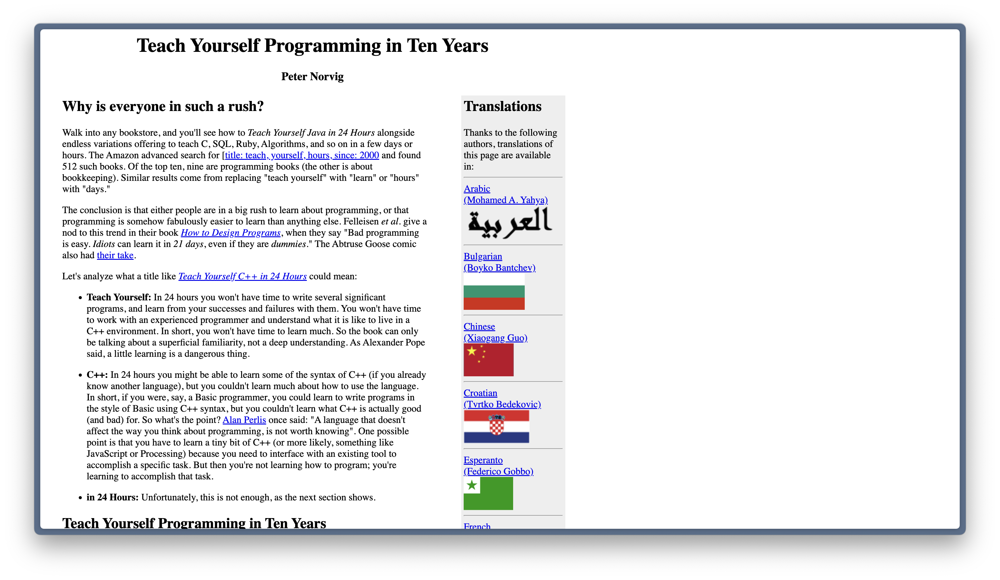

# Wrap Up

---
layout: section
---

## Why Are we Here?

---
layout: center
---

## Learning Objectives

1. **Apply** data science skills using real-world data to **create** meaningful, interactive applications addressing authentic problems.

2. **Analyze** and **implement** practical machine learning approaches to **solve** real-world problems, emphasizing pragmatic solutions over deep theory.

3. **Examine** and **employ** large language models (LLMs) to **enhance** data-driven applications.

---
layout: image-left
image: image-2.png
backgroundSize: contain
---

## Climbing the Tree of Knowledge

- **Python**: Programming language for data science and machine learning.
- **Basic Statistics**: Fundamental concepts for understanding data distributions and relationships.
- **Pandas**: Library for data manipulation and analysis.
- **Scikit-learn**: Library for machine learning algorithms.

My goal for this class was to teach you _just enough_ of these tools to show you some of the fruits up in the branches of this tree.

---
layout: section
---

---
layout: section
hideInToc: true
---

# Career Pathways

---
layout: image-right
image: image-1.png
---

### Software Engineer

**Role**: Develops, tests, and maintains software.

**Focus**: Often specialized (frontend/backend, product/infrastructure).

**Stakeholders**: Internal teams or external customers.

**Overlap**: Works closely with all other tech roles.

**Salary**: \$128K–\$253K  
<small>(Levels.fyi, 25th–75th percentile)</small>

**Education**:
- Typical: Bachelor’s in Computer Science
- Many are also self-taught

---
layout: image-right
image: image-2.png
---

### Data Engineer

**Role**: Designs and maintains data pipelines and models.

**Focus**: Data lifecycle and governance.

**Stakeholders**: Mostly technical (Data Scientists, Analysts).

**Overlap**: Strong ties to Software Engineering and MLE.

**Salary**: \$128K–\$253K  
<small>(Levels.fyi, 25th–75th percentile)</small>

**Education**:
- Typical: CS or Data Science degree
- Industry certifications are common

---
layout: image-right
image: image-3.png
---

### Machine Learning Engineer

**Role**: Builds and deploys ML models in production.

**Focus**: Performance monitoring and model serving.

**Stakeholders**: Technical leads or business units with KPIs.

**Overlap**: Primarily with Data Engineering and Data Science.

**Salary**: \$128K–\$253K  
<small>(Levels.fyi, 25th–75th percentile)</small>

**Education**:
- Typical: CS or Data Science background
- Certifications or specialized courses

---
layout: image-right
image: image-4.png
---

### Data Scientist

**Role**: Analyzes data to extract insights and drive decisions.

**Focus**: Exploratory analysis, predictive modeling, and visualizations.

**Stakeholders**: Can be technical teams or business executives.

**Overlap**: MLE, Data Engineering, and Business Analysts.

**Salary**: \$125K–\$222K  
<small>(Levels.fyi, 25th–75th percentile)</small>

**Education**:
- Common: Bachelor’s/Master’s in CS, Statistics
- Many have PhDs (“academic converts”)

---
layout: image-right
image: image-5.png
---

### Business Analyst

**Role**: Uses data to guide business decisions.

**Focus**: Reporting, dashboards, and stakeholder communication.

**Stakeholders**: Typically non-technical teams.

**Overlap**: Collaborates with Data Science and Data Engineering.

**Salary**: \$87K–\$145K  
<small>(Levels.fyi, 25th–75th percentile)</small>

**Education**:
- Often: Business, Economics, or Data Science degree

---
layout: image-right
image: image-6.png
---

### Research Scientist

**Role**: Conducts specialized research and experiments.

**Focus**: Developing new theories, publishing in journals/conferences.

**Stakeholders**: Primarily funded by grants or universities.

**Overlap**: Data Scientists, ML Engineers (in R&D settings).

**Salary**: Varies widely (often grant-based or academic scale)

**Education**:
- Typically a PhD in a relevant field
- Postdoc experience is common

---

## Kinds of Workplaces

| Type | Salary | Vibe | Job Security | Scope of Work |
|------|--------|------|--------------|---------------|
| Big Tech | High | Competitive | Good | Limited |
| Startups | Low | Exciting | Poor | Broad |
| Academia | Low | Intellectual | Good | Deep |
| Banks | High | Conservative | Good | Limited |
| Government | Low | Bureaucratic | Good | Broad |

---
layout: two-cols-header-2
---

## Fields That Use Data Science

::left::

Manufacturing

Finance

Molecular Biology

Healthcare

Supply Chain

Journalism

::right::

Education

Legal Services

Sales

Environmental Science

Marine Biology 

Public Policy

---
layout: center
---

> I’m a mediocre cartoonist, a mediocre writer, and a mediocre businessperson. But I’m a combination of all three, and the intersection of mediocrity makes me successful.

~ Scott Adams

---
layout: two-cols-header-2
---

## What to Study

::left::

### Math

- Calculus 1, 2
- **Linear Algebra**
- **Graph Theory**
- Abstract Algebra

### Statistics
- **Probability Theory**
- **Statistical Inference**
- Regression Analysis
- Elementary Stockastic Processes
- Time Series Analysis

::right::

### Computer Science

- **Data Structures**
- **Algorithms**
- **Databases**
- Computer Architecture
- Operating Systems
- Networking

### Soft Sciences

- Basic Psychology
- Philosophy of Language
- Logic

---
layout: center
---

{width=90%}

https://norvig.com/21-days.html

---
layout: section
hideInToc: true
---

# How to Be Successful

My three-step fool-proof plan to be successful in Data Science, Machine Learning, or anything.

---
layout: image-right
image: Screen Recording 2025-03-22 at 9.56.51 PM.gif
backgroundSize: contain
class: smaller-text
---

## Step 1: Be Interested

- You can do Data Science and Machine Learning without fixating on only that!
- Programming and Math are both enormous fields littered with interesting detours.
- Detours should not only be expected but embraced.

### Examples

- My years as a Ruby on Rails developer taught me how the internet works.

- My hobbies as a game developer reinforced my math skills and taught me how to think about state.

---
layout: image-right
image: 12seasons-nyc-2025-03-22.png
backgroundSize: contain
---

## Step 2: Make Stuff

- If you want to be a good coder, you need to write a lot of code.
- The same is true for Data Science and Machine Learning.
- Nothing will teach you more than doing the thing you want to be good at.
- Nothing will be more satisfying than having a stupid project idea and being about to run out an build it.

Learn some basic **Web Frameworks** (Flask, FastAPI, HTMX), **Game Frameworks**, (PyGame, Pico-8, PhaserJS), **Art Generation** frameworks (Processing, P5.js, three.js, d3.js), and **anything that interests you**.

---
layout: image-right
image: IMG_0025.JPG
---

## Step 3: Find Community

Building things is a life-long journey that's more fun with friends.

Surround yourself with people who are smart, hard-working, and share your passion.

### Examples
- Join your school Computer Science club.
- Take part in a hackathon.
- Attend a meetup.
- Join a Discord server.
- **Connect with your fellow students in this class.**

---
layout: cover
---

# Thank You

- I will be writing **Evaluation Letters** for all of you. These will include details about the course and the assignments you completed and will be delivered by Columbia.

- I will email you all of the slides at the end of this class and the source code will be available at at [github.com/x/bigd-103-summer-2025](https://github.com/x/bigd-103-summer-2025).

### Contact

**Personal Email**: [devon@peticol.as](mailto:devon@peticol.as)

**Personal Github**: [github.com/x](http://github.com/x)